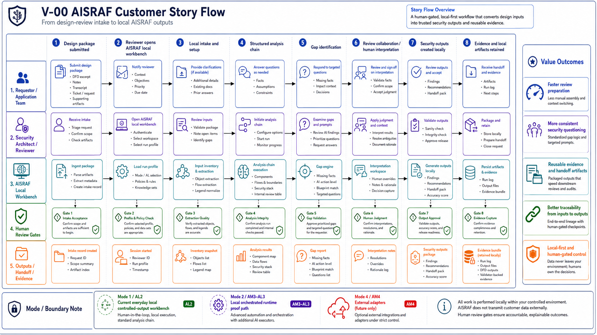
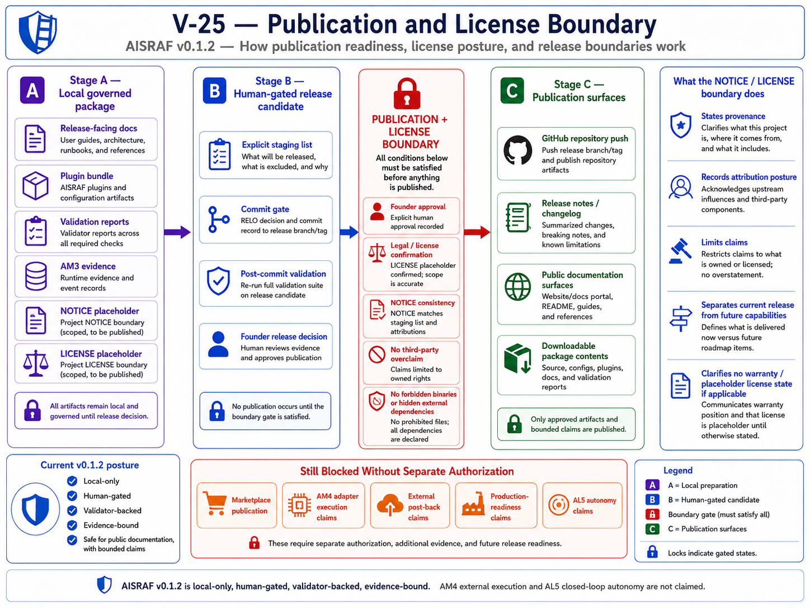

# AISRAF SAS Prototype v0.1.2

AISRAF SAS means AISRAF Security Advisory Services. This package is a local-first security advisory review prototype for testing how VS Code, GitHub Copilot, prompt cards, skill contracts, PRA specifications, local adapter wrappers, catalogs, blueprints, templates, samples, run profiles, validation checks, diagrams, and practitioner documentation work together.

> **Stakeholder reading entry point:** [docs/PROMPTS-SKILLS-AGENTS-TESTING-GUIDE.md](docs/PROMPTS-SKILLS-AGENTS-TESTING-GUIDE.md) — How AISRAF is assembled: prompts, skills, agents, run profiles, outputs, and validation.

> **Product flow entry point:** [docs/PRODUCT-FLOW-ROADMAP.md](docs/PRODUCT-FLOW-ROADMAP.md) — AISRAF as a product: Local Orchestrated Review, Run Observability / Runtime Evidence, Release QA Flow, planned Connected Review Flow, planned Threat Intelligence Enrichment, planned Plugin Install UX. The legacy `Mode 0/1/2/3/4` numbered list is retired for public use and is preserved only as internal vocabulary; see the mapping table in `docs/PRODUCT-FLOW-ROADMAP.md` section 10.

## Product Operating Model (Plain English)

AISRAF as a product is the sum of these flows. Closed-loop autonomy is **out of scope**.

| # | Flow | Status |
|---|---|---|
| 1 | Local Orchestrated Review — normal user flow; app/security architect creates a run, stages local inputs, uses `@aisraf-orchestrator`, produces local Markdown review outputs. | Current (v0.1.2). |
| 2 | Run Observability — captured alongside Local Orchestrated Review; records `00-run-log.md`, `runtime/run-state.yaml` (or equivalent), `runtime/events.ndjson` (or equivalent), handoff records, human gate records, and validation result summary. Not a separate public mode. | Current (v0.1.2) — emitted today through the local runtime evidence harness (`tools/Invoke-AisrafAm3LocalRun.ps1` + `tools/Test-AisrafAm3Runtime.ps1`). Target product experience is for the orchestrator to auto-emit this evidence during Local Orchestrated Review. |
| 3 | Release QA Flow — maintainer-only; validators, release manifests, bundle checksum, blocker reports, git hygiene, license posture, overclaim scans, binary checks, release readiness. | Current (v0.1.2). |
| 4 | Connected Review Flow — Jira intake, Confluence output, Lucid/Lucidchart source ingestion, Rovo/MCP mediation, local Markdown fallback, operator-approved post-back. | Planned (v0.2.0). Not implemented in v0.1.2. |
| 5 | Threat Intelligence Enrichment — `SKL-THREAT-INTEL-CURRENT-CONTEXT` using NVD CVE API, CISA KEV, vendor advisories, official product documentation/security pages; OSV / GitHub Security Advisories optional later. No internet result becomes a finding automatically. | Planned (v0.2.1). Not implemented in v0.1.2. |
| 6 | Mermaid Diagram Generation — generate a corrected Mermaid DFD from extracted components, flows, trust boundaries, data classifications, auth/authz, and encryption-in-transit / at-rest notes as a review aid. Original input diagram stays separate. | Planned. Not implemented in v0.1.2. |
| 7 | Plugin Install UX — repo-local evaluation now; clean plugin install/load UX later. | Planned (v0.1.3 onward). |

Detailed plans live in [docs/PRODUCT-FLOW-ROADMAP.md](docs/PRODUCT-FLOW-ROADMAP.md), [docs/CONNECTED-REVIEW-FLOW-PLAN.md](docs/CONNECTED-REVIEW-FLOW-PLAN.md), [docs/THREAT-INTELLIGENCE-ENRICHMENT-PLAN.md](docs/THREAT-INTELLIGENCE-ENRICHMENT-PLAN.md), [docs/PLUGIN-INSTALL-UX-PLAN.md](docs/PLUGIN-INSTALL-UX-PLAN.md), and [docs/BRANCH-RELEASE-STRATEGY.md](docs/BRANCH-RELEASE-STRATEGY.md).

## How Users Run AISRAF (Plain English)

Public users do **not** "run AM3." Public users run an **AISRAF Local Orchestrated Review**, and AISRAF captures observability evidence alongside the run. `AM3` / `AL3` remains **internal** architecture/evidence vocabulary in contracts, runtime files, and validation artifacts.

**Application architect / solution architect — pre-review:**

1. Create a run folder with `tools/New-AisrafRun.ps1`.
2. Add the DFD/source diagram, legend, design notes, intake notes, and transcript or questionnaire under `runs/<run_id>/inputs/`.
3. Start with `@aisraf-orchestrator`.
4. Get back: missing facts, internal review table, targeted questions, suggested controls, and corrected-diagram guidance.
5. Use those outputs to improve the design package before formal security review.

**Security architect — review:**

1. Receive the staged design package.
2. Stage it under a personal `runs/<run_id>/inputs/`.
3. Use `@aisraf-orchestrator` to run the review chain.
4. Review the extracted components, flows, trust boundaries, data classifications, authentication / authorization, encryption-in-transit notes, and storage / at-rest protection.
5. Produce findings, recommendations, handoff pack, validation notes, and an accuracy score where eligible.
6. Keep unknowns visible.

**Maintainer / release path:**

1. Run the validators.
2. Check manifests and the plugin bundle checksum.
3. Check blocker reports under `validation/`.
4. Confirm there are no binaries, no secrets, and no overclaim in the repo.
5. Confirm release posture before push / release.

## Internal Autonomy Vocabulary (For Contributors Only)

The terms below are **internal architecture/evidence vocabulary**. They are not the public way users describe what AISRAF does. Use the product flows above in public documentation.

- **AL means Autonomy Level:** how autonomous the user experience is (internal evidence vocabulary).
- **AM means Autonomy Mode / release evidence lane:** how AISRAF proves that autonomy capability (internal evidence vocabulary).
- **AM3 / AL3:** internal name for the local orchestrated runtime evidence path captured by Flow 2 (Run Observability / Runtime Evidence).
- **AM4 / AL4:** internal name for the future external-adapter/post-back capability covered by Flow 4 (planned Connected Review Flow).
- **AL5:** closed-loop autonomy; out of scope.

## v0.1.2 Release — Read First

AISRAF v0.1.2 proves AM3 / AL3 local orchestrated multi-agent runtime evidence. AM3 evidence is local-only, human-gated, validator-backed, and evidence-bound. This is an evidence-path claim, not a claim of full specialist-generated review output execution, production readiness, publication, or AM4 integration.

Gate state: release-decision stage commit closeout is accepted at HEAD `cc96644fa5263ccdaabcb0ff7ed9fb6282ac5ab5`, the public source-available evaluation-only license/notice posture is accepted, and the WP-13 visual pack / publication export prep gate is accepted. The current gate is **WP-12C-REL0-FINAL-PUBLIC-QA**. Stage/commit, push prep, push, tag, GitHub Release, AM4, and publication remain blocked until their explicit gates pass.

Publication posture: **Public source-available evaluation-only proof-of-concept. Not open source. Not production software. Not marketplace-published.** AM3 / AL3 local orchestrated runtime evidence only. AL2 controlled-output workbench remains the everyday user path. No AM4 adapter execution. No Jira, Confluence, Lucidchart, Rovo/MCP, cloud, database, Terraform, event bus, telemetry, or external post-back execution in v0.1.2. AL5 closed-loop autonomy is out of scope.

The day-to-day security architect and application architect experience remains a local controlled-output workbench under VS Code + GitHub Copilot. AISRAF runs against governed prompt cards, skill contracts, prototype-agent specifications, catalogs, blueprints, templates, samples, and run profiles. It does not execute external adapters and does not post back to Jira, Confluence, Lucidchart, Rovo, MCP, Azure AI Foundry, Google ADK, Microsoft Agent Framework, databases, Terraform, cloud runtimes, event buses, or telemetry systems.

## Release Visual Pack

The first public-quality visual pack is governed under [diagrams/release-v0.1.2/](diagrams/release-v0.1.2/) and registered in [diagrams/diagram-registry.yaml](diagrams/diagram-registry.yaml). The visuals are documentation assets for public evaluation only; they do not add runtime behavior, marketplace publication, production readiness, AM4 adapter execution, or AL5 autonomy.






## Local Review Journey

1. Clone or download the public GitHub proof-of-concept repository.
2. Open the repository folder in VS Code.
3. Start with `@aisraf-orchestrator` from the local/provider surface.
4. Create a personal run folder, for example:

```powershell
pwsh -NoProfile -File ./tools/New-AisrafRun.ps1 -RunId RUN-MY-REVIEW-001 -SampleId sample-001-dfd-crop -CopySampleInputs
```

5. Place or review DFD/design package inputs under `runs/RUN-MY-REVIEW-001/inputs/`.
6. Edit `runs/RUN-MY-REVIEW-001/run-profile.yaml`, including `sensitive_data_confirmed_redacted: true` only after confirming inputs are redacted.
7. Validate the run profile:

```powershell
pwsh -NoProfile -File ./tools/Test-AisrafRunProfile.ps1 -RunProfilePath ./runs/RUN-MY-REVIEW-001/run-profile.yaml -ExecutionReady
```

8. Prompt the orchestrator: `Run a local folder-first AISRAF review using runs/RUN-MY-REVIEW-001/run-profile.yaml. Do not use external adapters. Write outputs only under runs/RUN-MY-REVIEW-001/.`
9. Receive local Markdown outputs: `00-run-log.md`, `01-input-inventory.md` through `17-accuracy-score.md`, plus the DFD outputs under `dfd/01` through `dfd/09`.
10. Keep each run folder as local evidence/work product and use a separate `runs/<run_id>/` folder for each separate DFD or review.
11. Do not use `runs/RUN-001/` for personal reviews; it is the governed fixture.
12. v0.1.2 is not marketplace-published and performs no external post-back. Jira, Confluence, Lucidchart, Rovo/MCP, cloud, database, Terraform, event bus, telemetry, and external adapter execution are planned for the Connected Review Flow (Flow 4, v0.2.0); they are not implemented in v0.1.2.

### Command Options: PowerShell 7, Windows PowerShell, and Git Bash

The commands above are written for **PowerShell 7 (`pwsh`)** because that is the recommended shell. The validator ladder and helper scripts also run identically under **Windows PowerShell 5.1 (`powershell.exe`)**, and from **Git Bash** by calling `powershell.exe` explicitly. The WP-12C-REL0-CROSS-SHELL-COMMAND-UX gate validated all three shells against the full validator ladder; see [docs/COMMANDS.md](docs/COMMANDS.md) for the full cross-shell command table, the support matrix, and failure guidance.

```powershell
# PowerShell 7 / pwsh — recommended when installed
pwsh -NoProfile -File ./tools/New-AisrafRun.ps1 -RunId RUN-MY-REVIEW-001 -SampleId sample-001-dfd-crop -CopySampleInputs
```

```powershell
# Windows PowerShell / powershell.exe — works on Windows without PowerShell 7
powershell.exe -NoProfile -ExecutionPolicy Bypass -File .\tools\New-AisrafRun.ps1 -RunId RUN-MY-REVIEW-001 -SampleId sample-001-dfd-crop -CopySampleInputs
```

```bash
# Git Bash invoking powershell.exe — use forward slashes; quote paths with spaces
powershell.exe -NoProfile -ExecutionPolicy Bypass -File ./tools/New-AisrafRun.ps1 -RunId RUN-MY-REVIEW-001 -SampleId sample-001-dfd-crop -CopySampleInputs
```

If `pwsh` is not recognized on your system, use the `powershell.exe` form. The `-ExecutionPolicy Bypass` flag applies to the single command only; do not change the machine execution policy globally. The full per-command table for the validator ladder, git checks, and bundle rebuild is in [docs/COMMANDS.md](docs/COMMANDS.md).

License and notice posture: `LICENSE` and `NOTICE.md` now define a public source-available evaluation-only proof-of-concept posture. The license permits evaluation, review, demonstration, and proof-of-concept testing only, and does not grant production use, commercial use, redistribution, hosted service offering, or marketplace publication rights without separate written permission.

Public reader entrypoints (read these first):

- [docs/AISRAF-PRIMER.md](docs/AISRAF-PRIMER.md) — evaluator primer; what AISRAF is and is not. (Note: this primer still uses some of the older `AM`/`AL`/`Mode N` vocabulary; that vocabulary is now internal architecture/evidence vocabulary only. The public operating model is the seven flows above.)
- [docs/OPERATOR-QUICKSTART.md](docs/OPERATOR-QUICKSTART.md) — operator quickstart for local controlled-output review.
- [docs/COMMANDS.md](docs/COMMANDS.md) — cross-shell command table: PowerShell 7, Windows PowerShell, and Git Bash.
- [docs/SECURITY-REVIEW-WORKFLOW.md](docs/SECURITY-REVIEW-WORKFLOW.md) — security architect's end-to-end review workflow.
- [docs/ARCHITECTURE-OVERVIEW.md](docs/ARCHITECTURE-OVERVIEW.md) — maintainer architecture overview.
- [docs/ROADMAP.md](docs/ROADMAP.md) — release roadmap (v0.1.2 evaluation baseline; WP-13 release visuals registered; Connected Review Flow + Threat Intelligence Enrichment planned for v0.2.x).
- [docs/PRODUCT-FLOW-ROADMAP.md](docs/PRODUCT-FLOW-ROADMAP.md) — product operating model (Flows 1–7; closed-loop autonomy out of scope).
- [docs/CONNECTED-REVIEW-FLOW-PLAN.md](docs/CONNECTED-REVIEW-FLOW-PLAN.md) — planned Connected Review Flow (Jira, Confluence, Lucid, Rovo/MCP).
- [docs/THREAT-INTELLIGENCE-ENRICHMENT-PLAN.md](docs/THREAT-INTELLIGENCE-ENRICHMENT-PLAN.md) — planned `SKL-THREAT-INTEL-CURRENT-CONTEXT` skill.
- [docs/PLUGIN-INSTALL-UX-PLAN.md](docs/PLUGIN-INSTALL-UX-PLAN.md) — plugin install UX gates.
- [docs/BRANCH-RELEASE-STRATEGY.md](docs/BRANCH-RELEASE-STRATEGY.md) — branch and tag strategy across v0.1.x → v0.3.x.
- [RELEASE-MANIFEST.yaml](RELEASE-MANIFEST.yaml) — machine-readable release manifest.
- [CHANGELOG.md](CHANGELOG.md) — release changelog.

Release flow status (current product operating model):

| Flow | v0.1.2 status |
|---|---|
| Local Orchestrated Review (Flow 1) | Current everyday user flow. App/security architect creates a run, stages local inputs, uses `@aisraf-orchestrator`, produces local Markdown review outputs. Replaces the old "Mode 1 / AL2" label. |
| Run Observability (Flow 2) | Current. Captured alongside Flow 1. Target evidence set per run: `00-run-log.md`, `runtime/run-state.yaml` (or equivalent), `runtime/events.ndjson` (or equivalent), handoff records, human gate records, validation result summary. v0.1.2 emits this evidence today through the local runtime evidence harness (`tools/Invoke-AisrafAm3LocalRun.ps1` + `tools/Test-AisrafAm3Runtime.ps1`). The target product experience is for the orchestrator to auto-emit this evidence during a Local Orchestrated Review of any personal run folder. The accepted smoke evidence under `runs/RUN-SMOKE-AM3-001/` is internal and must not be staged or published in this gate. Replaces the old "Mode 2 / AM3 / AL3" label. |
| Release QA Flow (Flow 3) | Current maintainer-only path for validators, manifests, bundle checksum, blocker registers, license/overclaim scans, and QA reports. It does not generate practitioner review outputs. Replaces the old "Mode 3" label. |
| Connected Review Flow (Flow 4) | Planned for v0.2.0. Jira intake, Confluence output, Lucid/Lucidchart source ingestion, Rovo/MCP. Not implemented in v0.1.2. Replaces the old "Mode 4 / AM4" label. |
| Threat Intelligence Enrichment (Flow 5) | Planned for v0.2.1. `SKL-THREAT-INTEL-CURRENT-CONTEXT`. Not implemented in v0.1.2. |
| Mermaid Diagram Generation (Flow 6) | Planned. Generates a corrected Mermaid DFD from extracted facts as a review aid; original input diagram stays separate. Not implemented in v0.1.2. |
| Plugin Install UX (Flow 7) | Repo-local evaluation today; clean install/load UX planned for v0.1.3 onward. |

Closed-loop autonomy (autonomous decision and action without operator-in-the-loop) is **out of scope** for v0.1.2 and for the AISRAF roadmap.

Current autonomy posture details:

- **AL2 — controlled-output local workbench (current user experience).** Practitioner-driven prompt/skill execution in VS Code; outputs are governed Markdown under `runs/{run_id}/`.
- **AM3 / AL3 — local orchestrated multi-agent runtime evidence (proven evidence path).** AISRAF Orchestrator owns run-state and event log. Specialist handoffs are represented by AM3-01 through AM3-06 request/response pairs. Human gates remain required. The accepted smoke evidence is under local-only `runs/RUN-SMOKE-AM3-001/runtime/` and must not be staged or published in this gate.
- **AM4 / AL4 — external adapter / post-back execution (Jira, Confluence, Lucidchart, Rovo, MCP, Foundry, ADK, MAF, database, Terraform, cloud, event bus, telemetry).** Future adapter work. Not current release behavior.
- **AL5 — closed-loop autonomy.** Out of scope for v0.1.2 and the v0.1.x line.

The governed Build Package 13 visual pack is active under [diagrams/release-v0.1.2/](diagrams/release-v0.1.2/). It adds public-reader visuals and a diagram registry only; it does not edit AM3 runtime tools, AM3 contracts, AM3 smoke evidence, `runs/RUN-001/`, samples, canonical prompt/skill/prototype/catalog/blueprint/template/config surfaces, provider metadata, plugin metadata, or any AM4 adapter surface.

## Purpose

The prototype lets a practitioner test security-review methods locally before any runtime, cloud, MCP, or release layer is claimed. A user stages a DFD and supporting notes in a local run folder, uses governed instructions to read from `input_root`, writes structured outputs only under `output_root`, and compares against `expected_root` when baselines exist.

## Practical Value

The package is designed to test prompts, skills, adapters, DFD extraction, structured review outputs, validation, and handoff patterns locally. Later packages will add the artifacts needed to produce input inventories, visible objects, components, flows, boundaries, review tables, missing facts, AI Action Level, blueprint matches, questions, findings, recommendations, handoff packs, validation notes, and accuracy scores.

## Contributor / Governance Reading

The sections below describe the internal governed build sequence (Build Packages 01–12 plus the BP12C operator-experience and packaging increments). They are kept for contributors and governance reviewers; public readers should start from the docs/ entrypoints above.

## Current State

Build Packages 01–12 are governed and validator-green. BP12C operator-experience and plugin-packaging increments through WP-12C-REL0-B are committed. WP-12C-AM3-QA accepted only the bounded local runtime evidence claim. REL0 release-decision stage commit closeout is accepted at HEAD `cc96644fa5263ccdaabcb0ff7ed9fb6282ac5ab5`; WP-13 visual pack / publication export prep is accepted; the active gate is **WP-12C-REL0-FINAL-PUBLIC-QA**. Public release is not push-ready until final public QA, stage/commit, push prep, and publication gates are complete. AM4 adapter work, push, tag, GitHub Release, and publication remain blocked / future until their explicit gates pass.

- **Build Package 01** — Foundation, root structure, charter, manifest, folder contracts, build order, and authoring-agent instruction standard.
- **Build Package 02** — Config and run-profile variable model (`config/`).
- **Build Package 03** — Tools and setup/test/export scripts (`tools/`).
- **Build Package 04** — Prompts and prompt registry (`prompts/`): 23 canonical prompt cards (14 RS, 9 DFD) plus [prompts/prompt-registry.yaml](prompts/prompt-registry.yaml).
- **Build Package 05** — Skills and skill registry (`skills/`): 26 canonical skill contracts (17 RS, 9 DFD) plus [skills/skill-registry.yaml](skills/skill-registry.yaml). Each skill contract wraps one Build Package 04 prompt card with a 14-section reusable work contract.
- **Build Package 06** — Prototype agents, PRA specs, and `.agent.md` adapter model (`prototype-agents/`, `.agents/`): 8 canonical Prototype Review Agent specs (PRA-01..PRA-08) plus [prototype-agents/prototype-agent-registry.yaml](prototype-agents/prototype-agent-registry.yaml), and 7 thin local `.agent.md` adapter wrappers under [.agents/](.agents/) (orchestrator, input-reader, dfd-extractor, review-table-builder, blueprint-questioner, finding-recommender, handoff-qa-scorer). PRA-04-LEGEND-NORMALIZER has no dedicated adapter; it is wrapped jointly with PRA-03 by [.agents/aisraf-dfd-extractor.agent.md](.agents/aisraf-dfd-extractor.agent.md). PRAs and adapters are specifications/wrappers, not deployed runtime agents.
- **Build Package 07** — Catalogs (`catalogs/`): 24 controlled-vocabulary YAML catalogs across 7 families (components, interactions, boundaries, identity-access, data-protection, security-stacks, review) plus [catalogs/catalog-registry.yaml](catalogs/catalog-registry.yaml) and 8 READMEs. Two catalogs are cross-cutting: [catalogs/security-stacks/proof-vs-signal-rule-catalog.yaml](catalogs/security-stacks/proof-vs-signal-rule-catalog.yaml) (`global_rule: true`) and [catalogs/data-protection/confidence-level-catalog.yaml](catalogs/data-protection/confidence-level-catalog.yaml) (`cross_cutting_catalog: true`). Catalogs are read-only at runtime; they are not executable tools, runtime services, blueprints, prompts, skills, agent logic, or runbooks. Build Package 07 did not modify any prompt, skill, prototype-agent, or adapter registry.
- **Build Package 08** — Blueprints (`blueprints/`): 9 controlled YAML blueprints split across two category folders (8 under [blueprints/platform-independent/](blueprints/platform-independent/) and 1 under [blueprints/cloud-patterns/](blueprints/cloud-patterns/)) plus [blueprints/blueprint-registry.yaml](blueprints/blueprint-registry.yaml), [blueprints/blueprint-template.yaml](blueprints/blueprint-template.yaml), and 3 READMEs (14 files total). Match states are fixed at four values: `matched`, `candidate`, `no_match`, `unknown`. Each blueprint references Build Package 07 catalog identifiers only; no new catalog values are introduced. Blueprints scope catalog evidence and surface material missing facts; selection of severity, AI Action Level, finding categories, recommendation types, and final disposition is owned by the consuming Build Package 05 skills and human review. Build Package 08 did not modify any prompt, skill, prototype-agent, adapter, or catalog registry.
- **Build Package 09** — Templates (`templates/`): 31 reusable Markdown output-shape templates across 4 family folders (27 under [templates/output/](templates/output/), 1 under [templates/jira/](templates/jira/), 1 under [templates/confluence/](templates/confluence/), 2 under [templates/run/](templates/run/)) plus [templates/template-registry.yaml](templates/template-registry.yaml) and 5 READMEs (37 files total). Templates define output shape only; they do not execute the review, do not compute severity / score / AI Action Level / blueprint match, do not invent finding facts or recommendation prose, and do not claim Jira / Confluence / Rovo / MCP / runtime / cloud / ADK / database / Terraform execution. Templates use only the seven approved run-profile placeholder variables; other run-profile fields are referenced descriptively as `[copy from runs/{{run_id}}/run-profile.yaml#field_name]`. Catalog values are referenced via `<value-from-catalogs/...>` placeholder syntax (no enumeration inside template bodies; founder decision Q3). Build Package 09 did not modify any prompt, skill, prototype-agent, adapter, catalog, or blueprint registry; template→prompt, template→skill, template→PRA, template→adapter, template→blueprint, and template→catalog consumer maps are recorded only in [templates/template-registry.yaml](templates/template-registry.yaml) and the validation checklists.
- **Build Package 10** — Samples and expected baselines (`samples/`): 1 active sample (`sample-001-dfd-crop` — AI SaaS Security Review Portal scenario) plus [samples/sample-registry.yaml](samples/sample-registry.yaml). Sample-001 carries 6 synthetic inputs (`inputs/dfd-crop.png`, `inputs/dfd-crop.mmd`, `inputs/dfd-legend-excerpt.md`, `inputs/cloud-triage-notes.md`, `inputs/review-transcript.md`, `inputs/intake-ticket.md`) and 26 Markdown expected baselines (17 RS mirroring `templates/output/output-01..17-*-template.md` and 9 DFD mirroring `templates/output/output-dfd-01..09-*-template.md`). `expected-00-run-log.md` is intentionally not created (founder decision Q2: run logs are run artefacts deferred to Build Package 11). Samples 002–008 are recorded as `planned_or_deferred_samples` entries inside [samples/sample-registry.yaml](samples/sample-registry.yaml) only — no folders or files (founder decision Q8). Samples are test fixtures: synthetic only, no real PII / PAN / SSN / PHI / secrets / credentials / production endpoints; no Jira post-back / Confluence publication / Rovo / MCP / runtime / cloud / ADK / Vertex / GCP / database / Terraform execution claims; no severity / finding-category / AI Action Level / blueprint-match / accuracy-score computation inside expected-baseline bodies; no new BP-* identifiers or controlled values introduced. Numeric scoring is qualitative (`PASS_READY_FOR_REVIEW`) until Build Package 11 run execution validates numeric scoring (founder decision Q5; the v0.01 reference 151/160 is recorded as `legacy_reference_score` only). Build Package 10 did not modify any prompt, skill, prototype-agent, adapter, catalog, blueprint, template, or config registry.
- **Build Package 12** — Validation framework (`validation/`): 10 new validation files standing up the full validation taxonomy (package, registry, chain, sample, run, cross-cutting, forward, final-QA gates) — [validation/package-12-validation-checklist.md](validation/package-12-validation-checklist.md), [validation/scoring-rubric-checklist.md](validation/scoring-rubric-checklist.md), [validation/package-lint-master-checklist.md](validation/package-lint-master-checklist.md), [validation/expected-output-lint-checklist.md](validation/expected-output-lint-checklist.md), [validation/prompt-skill-pra-parity-checklist.md](validation/prompt-skill-pra-parity-checklist.md), [validation/sample-input-readiness-checklist.md](validation/sample-input-readiness-checklist.md), [validation/local-run-readiness-checklist.md](validation/local-run-readiness-checklist.md), [validation/prototype-execution-readiness-checklist.md](validation/prototype-execution-readiness-checklist.md), [validation/diagram-readiness-pre-render-checklist.md](validation/diagram-readiness-pre-render-checklist.md), [validation/docs-readiness-pre-render-checklist.md](validation/docs-readiness-pre-render-checklist.md), [validation/final-qa-checklist.md](validation/final-qa-checklist.md). [validation/README.md](validation/README.md) is rebuilt as the validation taxonomy index with a top-of-file BLOCKERS section. [validation/no-drift-rules.md](validation/no-drift-rules.md) carries 14 numbered Build Package 12 amendments. `runs/RUN-001/dfd/.gitkeep` is added as a fresh-clone reservation marker (the only file permitted in that empty governed folder until DFD outputs exist). `tools/Test-AisrafPackage.ps1` carries 3 surgical patches (synopsis update, Check 08i `.gitkeep` allowance, Check 11 allow-list extension). **`BP12-SAMPLE-DFD-BLOCKER`** is recorded as a hard, named, non-silent carried-forward blocker on the canonical sample DFD (`samples/sample-001-dfd-crop/inputs/dfd-crop.png`/`.mmd` and the byte-copies under `runs/RUN-001/inputs/`); it is cross-referenced in 6 validation files plus `PACKAGE-MANIFEST.yaml` and pins Build Package 13 entry until a founder-approved Package 10A / 11A correction lands OR sample-002 with a clean DFD is authorized — see [validation/sample-input-readiness-checklist.md](validation/sample-input-readiness-checklist.md). Build Package 12 did not modify any sealed Build Package 01–11 surface, did not modify the sample DFD or its byte-copy, did not modify any expected baseline, did not create any diagram / runbook / release artefact / runtime / cloud / MCP proof, and did not author sample-002.
- **Build Package 11** — Runs and execution evidence model (`runs/`): 1 first canonical governed run fixture (`runs/RUN-001/` for `sample-001-dfd-crop`) plus 4 governance checklists (`validation/package-11-runs-checklist.md`, `validation/run-folder-shape-checklist.md`, `validation/run-log-checklist.md`, `validation/run-comparison-checklist.md`). RUN-001 carries [runs/RUN-001/run-profile.yaml](runs/RUN-001/run-profile.yaml) (Build Package 02 schema-compliant; `mode: folder_first_test`, `output_destination_mode: local_only`, `postback_execution_status: deferred`, `sensitive_data_confirmed_redacted: true`, `expected_baseline_required: true`, `scoring_enabled: true`), [runs/RUN-001/00-run-log.md](runs/RUN-001/00-run-log.md) (Build Package 09 file-shape compliant per `templates/output/output-00-run-log-template.md`; Step Entries / Post-Back Evidence / Stop Conditions Recorded sections empty), [runs/RUN-001/README.md](runs/RUN-001/README.md), 6 byte-copies of the sample-001 inputs under `runs/RUN-001/inputs/`, and an empty governed `runs/RUN-001/dfd/` folder. The 17 RS chain outputs at `runs/RUN-001/01-input-inventory.md` … `17-accuracy-score.md` and the 9 DFD subskill outputs at `runs/RUN-001/dfd/dfd-01-intake-quality-check.md` … `dfd-09-extraction-summary.md` are reserved future paths produced when the operator executes the Build Package 04–09 chain — Build Package 11 does NOT create them and does NOT execute the chain. Numeric accuracy scoring is owned by `prompts/rs/13-accuracy-score.prompt.md` / `skills/rs/SK-ACCURACY-SCORE.md` and activates only when the operator executes the chain. Build Package 11 did not modify any prompt, skill, prototype-agent, adapter, catalog, blueprint, template, sample, or config registry, and did not modify `tools/New-AisrafRun.ps1` or `tools/Test-AisrafRunProfile.ps1`. Other `runs/RUN-*` folders are smoke runs from `tools/New-AisrafRun.ps1` and must be removed before human git stage; `tools/Test-AisrafPackage.ps1` records each non-RUN-001 folder as WARN. The known mismatch between `tools/New-AisrafRun.ps1`'s legacy 00-run-log header and the Package 09 file shape is recorded as a future Build Package 03 increment compatibility note in `validation/run-log-checklist.md`.

Build Packages 01-12 did not execute the Build Package 04-09 chain, did not produce the 26 reserved chain outputs in any run folder, and did not create diagrams, docs/runbooks, DOCX/PDF/PPTX/ZIP artifacts, runtime code, schemas outside `config/`, cloud resources, MCP proof, or ADK proof.

Build Package numbers define the implementation sequence. Root Area numbers define visible package-tree rows and folder ownership. Root Area 01 is Root & Top-Level Files, followed by the 17 actual root folders.

## Reference Policy

The old package at `D:/E-Way 2/aisraf-sas-prototype-skill-chain-pack-v0.01` is reference-only. It may be read for intent, naming, lessons learned, and useful patterns. It must not be modified, and stale release artifacts, low-quality diagrams, failed outputs, run proof, and temporary reports must not be copied into this clean rebuild.

## Where To Start

### Public readers

1. Read [docs/AISRAF-PRIMER.md](docs/AISRAF-PRIMER.md) for what AISRAF is and what it is not.
2. Operators: read [docs/OPERATOR-QUICKSTART.md](docs/OPERATOR-QUICKSTART.md).
3. Security architects: read [docs/SECURITY-REVIEW-WORKFLOW.md](docs/SECURITY-REVIEW-WORKFLOW.md).
4. Maintainers: read [docs/ARCHITECTURE-OVERVIEW.md](docs/ARCHITECTURE-OVERVIEW.md) and [RELEASE-MANIFEST.yaml](RELEASE-MANIFEST.yaml).
5. Roadmap reviewers: read [docs/ROADMAP.md](docs/ROADMAP.md).

### Contributors and governance reviewers

1. Read [START-HERE.md](START-HERE.md).
2. Read [PROTOTYPE-CHARTER.md](PROTOTYPE-CHARTER.md).
3. Read [BUILD-ORDER.md](BUILD-ORDER.md).
4. Use [FOLDER-CONTRACTS.md](FOLDER-CONTRACTS.md) before writing anything in a later package.
5. Read [validation/README.md](validation/README.md) for the full validation taxonomy and the BLOCKERS section naming `BP12-SAMPLE-DFD-BLOCKER`.

## Build Order

The governed build sequence is recorded in [BUILD-ORDER.md](BUILD-ORDER.md).

## Next Build Package

The immediate governed gate is **WP-12C-REL0-FINAL-PUBLIC-QA**. If it passes, the next gate is **REL0-STAGE-COMMIT**. Push prep, push, tag, GitHub Release, publication, and AM4 adapter work remain blocked until their explicit gates pass.

Out-of-scope-for-this-release governed work, retained here so a contributor cannot mistake it for current release behavior:

- **Full specialist-generated review output execution** — not proven by the current Run Observability / Runtime Evidence flow.
- **Connected Review Flow adapter work (Flow 4)** — Jira, Confluence, Lucidchart, Rovo, MCP, Foundry, ADK, MAF, database, Terraform, cloud, event bus, telemetry, post-back execution. Planned for v0.2.0. Not implemented in v0.1.2. See `docs/CONNECTED-REVIEW-FLOW-PLAN.md`.
- **Threat Intelligence Enrichment (Flow 5)** — `SKL-THREAT-INTEL-CURRENT-CONTEXT`. Planned for v0.2.1. Not implemented in v0.1.2. See `docs/THREAT-INTELLIGENCE-ENRICHMENT-PLAN.md`.

## Not Yet Created

- No DOCX/PDF release export binaries are committed by WP-13; Word/PDF outputs are deferred to GitHub Release assets or later exact-path authorization.
- Run Observability / Runtime Evidence (Flow 2, internal vocabulary: AM3 / AL3) is proven only as a local evidence path under `runs/RUN-SMOKE-AM3-001/runtime/`; it is not staged or published in this gate.
- No Connected Review Flow adapters yet (planned for v0.2.0; not current release).
- No Threat Intelligence Enrichment yet (planned for v0.2.1; not current release).
- No chain execution against `runs/RUN-001/` yet (the run fixture is governed; the 26 reserved chain outputs activate only when the operator executes the Package 04–09 chain).
- No numeric accuracy score against `runs/RUN-001/` yet.
- No external adapter execution, cloud runtime, MCP, Jira / Confluence / Lucidchart / Rovo post-back, Foundry, ADK, MAF, database, Terraform, event-bus, telemetry, push, publish, or production-operation proof.
