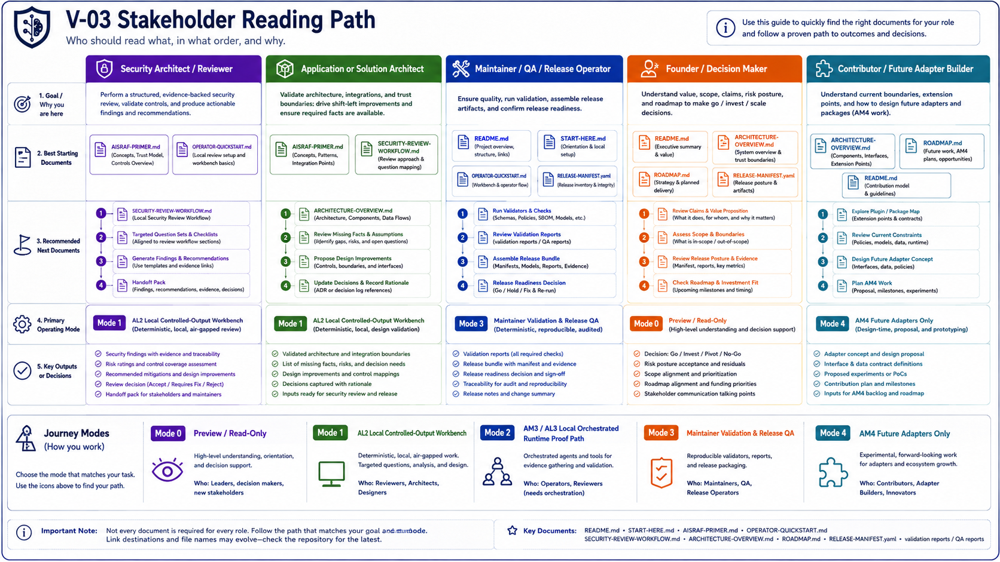
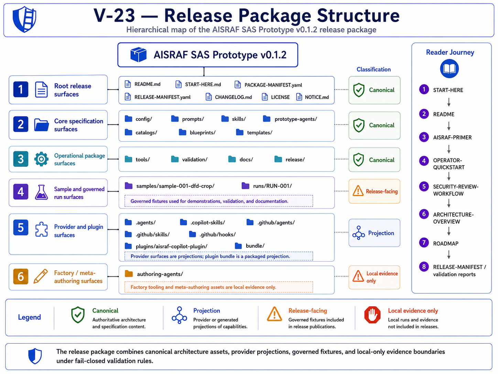
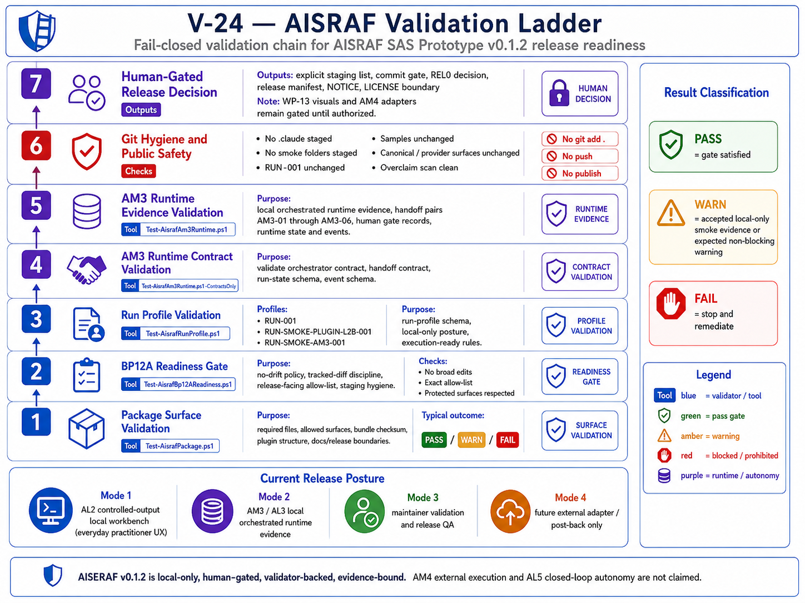

# Start Here

Package: AISRAF SAS Prototype v0.1.2

> **Stakeholder reading entry point:** [docs/PROMPTS-SKILLS-AGENTS-TESTING-GUIDE.md](docs/PROMPTS-SKILLS-AGENTS-TESTING-GUIDE.md) — How AISRAF is assembled: prompts, skills, agents, run profiles, outputs, and validation.

> **Product flow entry point:** [docs/PRODUCT-FLOW-ROADMAP.md](docs/PRODUCT-FLOW-ROADMAP.md) — AISRAF as a product: Local Orchestrated Review, Run Observability / Runtime Evidence, Release QA Flow, planned Connected Review Flow, planned Threat Intelligence Enrichment, planned Plugin Install UX. The legacy `Mode 0/1/2/3/4` numbered list is retired for public use.

## Product Operating Model (Plain English)

| # | Flow | Status |
|---|---|---|
| 1 | Local Orchestrated Review — normal user flow; app/security architect creates a run, stages local inputs, uses `@aisraf-orchestrator`, produces local Markdown review outputs. | Current (v0.1.2). |
| 2 | Run Observability — captured alongside Flow 1; target evidence set per run: `00-run-log.md`, `runtime/run-state.yaml` (or equivalent), `runtime/events.ndjson` (or equivalent), handoff records, human gate records, validation result summary. v0.1.2 emits this evidence today through a local runtime evidence harness; the target product experience is for the orchestrator to auto-emit during Flow 1. Not a separate public mode. | Current (v0.1.2). |
| 3 | Release QA Flow — maintainer-only; validators, manifests, bundle checksum, blocker registers, license/overclaim scans, QA reports. | Current (v0.1.2). |
| 4 | Connected Review Flow — Jira intake, Confluence output, Lucid/Lucidchart source ingestion, Rovo/MCP, post-back controls. | Planned (v0.2.0). Not implemented in v0.1.2. |
| 5 | Threat Intelligence Enrichment — `SKL-THREAT-INTEL-CURRENT-CONTEXT` using NVD CVE API, CISA KEV, vendor advisories, official product documentation/security pages. | Planned (v0.2.1). Not implemented in v0.1.2. |
| 6 | Mermaid Diagram Generation — corrected Mermaid DFD generated from extracted components, flows, trust boundaries, data classifications, auth/authz, and encryption-in-transit / at-rest notes; original input diagram stays separate. | Planned. Not implemented in v0.1.2. |
| 7 | Plugin Install UX — repo-local evaluation today; clean install/load UX later. | Planned (v0.1.3 onward). |

Closed-loop autonomy is **out of scope**. Detailed plans live in [docs/PRODUCT-FLOW-ROADMAP.md](docs/PRODUCT-FLOW-ROADMAP.md), [docs/CONNECTED-REVIEW-FLOW-PLAN.md](docs/CONNECTED-REVIEW-FLOW-PLAN.md), [docs/THREAT-INTELLIGENCE-ENRICHMENT-PLAN.md](docs/THREAT-INTELLIGENCE-ENRICHMENT-PLAN.md), [docs/PLUGIN-INSTALL-UX-PLAN.md](docs/PLUGIN-INSTALL-UX-PLAN.md), and [docs/BRANCH-RELEASE-STRATEGY.md](docs/BRANCH-RELEASE-STRATEGY.md).

## How Users Run AISRAF (Plain English)

Public users do **not** "run AM3." Public users run an **AISRAF Local Orchestrated Review**, and AISRAF captures observability evidence alongside the run.

- **Application architect / solution architect — pre-review.** Create a run folder, add DFD/source + legend + design notes + intake notes + transcript/questionnaire under `runs/<run_id>/inputs/`, start with `@aisraf-orchestrator`, get missing facts + review table + targeted questions + suggested controls + corrected-diagram guidance, improve the design before formal review.
- **Security architect — review.** Receive the staged design package, stage it under a personal `runs/<run_id>/inputs/`, use `@aisraf-orchestrator` to run the review chain, review the extracted components / flows / boundaries / data classes / auth-authz / encryption / storage protection, produce findings + recommendations + handoff pack + validation notes + score where eligible, keep unknowns visible.
- **Maintainer / release path.** Run validators, check manifests + plugin bundle checksum, check blocker reports, confirm no binaries / no secrets / no overclaim, confirm release posture, then decide on push / stage / commit / tag / release.

## Internal Autonomy Vocabulary (For Contributors Only)

The terms below are **internal architecture/evidence vocabulary**. They are not the public way users describe what AISRAF does. Use the product flows above in public documentation.

- **AL means Autonomy Level:** how autonomous the user experience is (internal evidence vocabulary).
- **AM means Autonomy Mode / release evidence lane:** how AISRAF proves that autonomy capability (internal evidence vocabulary).
- **AM3 / AL3:** internal name for the local orchestrated runtime evidence path captured by Flow 2 (Run Observability / Runtime Evidence).
- **AM4 / AL4:** internal name for the future external-adapter/post-back capability covered by Flow 4 (planned Connected Review Flow).
- **AL5:** closed-loop autonomy; out of scope.

AISRAF v0.1.2 proves AM3 / AL3 local orchestrated multi-agent runtime evidence. AM3 evidence is local-only, human-gated, validator-backed, and evidence-bound. This is an evidence-path claim, not a claim of full specialist-generated review output execution, production readiness, publication, or AM4 integration.

Gate state: release-decision stage commit closeout is accepted at HEAD `cc96644fa5263ccdaabcb0ff7ed9fb6282ac5ab5`, the public source-available evaluation-only license/notice posture is accepted, and the WP-13 visual pack / publication export prep gate is accepted. The current gate is **WP-12C-REL0-FINAL-PUBLIC-QA**. Stage/commit, AM4, push, tag, GitHub Release, and publication remain blocked until their explicit gates pass.

Publication posture: **Public source-available evaluation-only proof-of-concept. Not open source. Not production software. Not marketplace-published.** AM3 / AL3 local orchestrated runtime evidence only. AL2 controlled-output workbench remains the everyday user path. No AM4 adapter execution. No Jira, Confluence, Lucidchart, Rovo/MCP, cloud, database, Terraform, event bus, telemetry, or external post-back execution in v0.1.2. AL5 closed-loop autonomy is out of scope.

The everyday security architect and application architect workflow remains a local controlled-output workbench. AISRAF does not execute external adapters or post back to Jira, Confluence, Lucidchart, Rovo, MCP, Azure AI Foundry, Google ADK, Microsoft Agent Framework, databases, Terraform, cloud runtimes, event buses, or telemetry systems (AM4 / AL4, future). AL5 closed-loop autonomy is out of scope.

## Review Journey In One Pass

1. Read [LICENSE](LICENSE) and [NOTICE.md](NOTICE.md) first; AISRAF v0.1.2 is public source-available evaluation-only, not open source, not production software, and not marketplace-published.
2. Review the autonomy terms above so Mode 1 local workbench, AM3 / AL3 local evidence, future AM4, and out-of-scope AL5 stay separate.
3. Open [docs/OPERATOR-QUICKSTART.md](docs/OPERATOR-QUICKSTART.md) for the operator path, then clone or download the public GitHub proof-of-concept repository.
4. Open the repository folder in VS Code.
5. Start with `@aisraf-orchestrator` from the local/provider surface.
6. Create a personal run folder, for example:

```powershell
pwsh -NoProfile -File ./tools/New-AisrafRun.ps1 -RunId RUN-MY-REVIEW-001 -SampleId sample-001-dfd-crop -CopySampleInputs
```

7. Put DFD/design package inputs under `runs/<run_id>/inputs/`, for example `runs/RUN-MY-REVIEW-001/inputs/`.
8. Edit `runs/RUN-MY-REVIEW-001/run-profile.yaml`, including `sensitive_data_confirmed_redacted: true` only after confirming inputs are redacted.
9. Validate the run profile:

```powershell
pwsh -NoProfile -File ./tools/Test-AisrafRunProfile.ps1 -RunProfilePath ./runs/RUN-MY-REVIEW-001/run-profile.yaml -ExecutionReady
```

10. Prompt the orchestrator: `Run a local folder-first AISRAF review using runs/RUN-MY-REVIEW-001/run-profile.yaml. Do not use external adapters. Write outputs only under runs/RUN-MY-REVIEW-001/.`
11. Receive local Markdown outputs: `00-run-log.md`, `01-input-inventory.md` through `17-accuracy-score.md`, plus the DFD outputs under `dfd/01` through `dfd/09`.
12. Keep the run folder as local evidence/work product and use a separate `runs/<run_id>/` folder for each separate DFD or review.
13. Do not use `runs/RUN-001/` for personal reviews; it is the governed fixture.
14. v0.1.2 is not marketplace-published and performs no external post-back. Jira, Confluence, Lucidchart, Rovo/MCP, cloud, database, Terraform, event bus, telemetry, and external adapter execution are planned for the Connected Review Flow (Flow 4, v0.2.0); they are not implemented in v0.1.2.

License and notice posture: `LICENSE` and `NOTICE.md` now define a public source-available evaluation-only proof-of-concept posture. The license permits evaluation, review, demonstration, and proof-of-concept testing only, and does not grant production use, commercial use, redistribution, hosted service offering, or marketplace publication rights without separate written permission.

## First 15 Minutes (Public Evaluator Path)

If you have just landed on the AISRAF v0.1.2 GitHub repository for evaluation and want a fast, predictable path through the package, follow these seven steps.

1. **Confirm license/notice posture.** Read [LICENSE](LICENSE) and [NOTICE.md](NOTICE.md). AISRAF v0.1.2 is **public source-available evaluation-only**. It is **not open source**, **not production software**, and **not marketplace-published**. Confirm this posture matches your intent before continuing.
2. **Open the repository folder in VS Code.** Clone or download the public proof-of-concept repository, then open the repo folder in VS Code with GitHub Copilot enabled. The local provider surface (`.agents/`, `.github/agents/`, `.github/skills/`, `.github/hooks/`, `.copilot-skills/`, `plugins/aisraf-copilot-plugin/`) is what Copilot discovers. There is no one-click marketplace install in v0.1.2 — that clean install/load UX is planned for v0.1.3 onward under [docs/PLUGIN-INSTALL-UX-PLAN.md](docs/PLUGIN-INSTALL-UX-PLAN.md).
3. **Read [docs/COMMANDS.md](docs/COMMANDS.md).** This is the canonical cross-shell command table for PowerShell 7 (`pwsh`), Windows PowerShell 5.1 (`powershell.exe`), and Git Bash invoking `powershell.exe`. If `pwsh` is not on your workstation, use the `powershell.exe` form.
4. **Read [docs/OPERATOR-QUICKSTART.md](docs/OPERATOR-QUICKSTART.md).** This is the operator path for Local Orchestrated Review (Flow 1): the everyday user flow.
5. **Use `@aisraf-orchestrator` as first contact.** From Copilot Chat, start the conversation at `@aisraf-orchestrator`. It is the recommended entry point and coordinates the whole review chain. The six specialist agents (`@aisraf-input-reader`, `@aisraf-dfd-extractor`, `@aisraf-review-table-builder`, `@aisraf-blueprint-questioner`, `@aisraf-finding-recommender`, `@aisraf-handoff-qa-scorer`) are helpers. Do not start at a specialist agent unless you want a single targeted step.
6. **Create a new run folder for a real review.** Use `tools/New-AisrafRun.ps1` to scaffold `runs/<run_id>/`. Reviews 1, 2, 3, ... each get their own `runs/<run_id>/` folder (for example `RUN-MY-REVIEW-001`, `RUN-MY-REVIEW-002`, `RUN-MY-REVIEW-003`). Cross-shell commands for the scaffold are in [docs/COMMANDS.md](docs/COMMANDS.md).
7. **Do not use `runs/RUN-001/` for personal review work.** `RUN-001` is the governed validator fixture for `sample-001-dfd-crop`. Editing it breaks the validator ladder. Personal review work always goes under a fresh `runs/<run_id>/`.

What success looks like after the first 15 minutes:

- You can identify the seven product flows in [docs/PRODUCT-FLOW-ROADMAP.md](docs/PRODUCT-FLOW-ROADMAP.md), recognize that Flow 1 (Local Orchestrated Review) is the everyday flow, recognize that Flow 4 (Connected Review Flow), Flow 5 (Threat Intelligence Enrichment), and Flow 6 (Mermaid Diagram Generation) are planned, and recognize that closed-loop autonomy is out of scope.
- You know that you talk to `@aisraf-orchestrator` first.
- You have a personal `runs/<run_id>/` folder scaffolded, with `inputs/`, `dfd/`, and a `run-profile.yaml` produced by `tools/New-AisrafRun.ps1`.
- You can run the validator ladder (`Test-AisrafPackage.ps1`, `Test-AisrafBp12AReadiness.ps1`, `Test-AisrafRunProfile.ps1 ... -ExecutionReady`) from your shell of choice using the commands in [docs/COMMANDS.md](docs/COMMANDS.md).
- You can name what AISRAF v0.1.2 does **not** do today: no marketplace install, no external adapter execution (Jira/Confluence/Lucid/Rovo/MCP/cloud/database/Terraform/event-bus/telemetry/post-back), no online threat-intelligence execution, no Mermaid diagram generation, no direct PNG/PDF DFD extraction, and no closed-loop autonomy.

## Visual Read Path

The first public visual pack is registered in [diagrams/diagram-registry.yaml](diagrams/diagram-registry.yaml) and indexed under [diagrams/release-v0.1.2/](diagrams/release-v0.1.2/). These visuals orient readers to roles, package structure, and validation controls; they are not publication proof, production proof, marketplace proof, AM4 proof, or AL5 proof.







Release flow status (current product operating model):

| Flow | v0.1.2 status |
|---|---|
| Local Orchestrated Review (Flow 1) | Current everyday flow for security architects and application architects. Outputs are local governed Markdown under an approved run folder. |
| Run Observability (Flow 2) | Current. Captured alongside Flow 1. Target evidence set per run: `00-run-log.md`, `runtime/run-state.yaml` (or equivalent), `runtime/events.ndjson` (or equivalent), handoff records, human gate records, validation result summary. v0.1.2 emits this evidence today through the local runtime evidence harness (`tools/Invoke-AisrafAm3LocalRun.ps1` + `tools/Test-AisrafAm3Runtime.ps1`). The target product experience is for the orchestrator to auto-emit this evidence during Local Orchestrated Review of any personal run folder. The accepted smoke evidence under `runs/RUN-SMOKE-AM3-001/` is internal and must not be staged or published in this gate. |
| Release QA Flow (Flow 3) | Current maintainer-only path for package validators, release manifests, blocker registers, bundle checksum validation, license/overclaim scans, and QA closeout. |
| Connected Review Flow (Flow 4) | Planned for v0.2.0. Jira, Confluence, Lucidchart, Rovo/MCP. Not implemented in v0.1.2. |
| Threat Intelligence Enrichment (Flow 5) | Planned for v0.2.1. Not implemented in v0.1.2. |
| Mermaid Diagram Generation (Flow 6) | Planned. Generates a corrected Mermaid DFD from extracted facts as a review aid; original input diagram stays separate. Not implemented in v0.1.2. |
| Plugin Install UX (Flow 7) | Repo-local evaluation today; clean install/load UX planned for v0.1.3 onward. |

Closed-loop autonomy is out of scope.

## v0.1.2 Release — Read First

Pick the entrypoint that matches your role.

- **New evaluator** — start with [docs/AISRAF-PRIMER.md](docs/AISRAF-PRIMER.md).
- **Operator** — start with [docs/OPERATOR-QUICKSTART.md](docs/OPERATOR-QUICKSTART.md).
- **Security architect** — start with [docs/SECURITY-REVIEW-WORKFLOW.md](docs/SECURITY-REVIEW-WORKFLOW.md).
- **Maintainer** — read [docs/ARCHITECTURE-OVERVIEW.md](docs/ARCHITECTURE-OVERVIEW.md) and [RELEASE-MANIFEST.yaml](RELEASE-MANIFEST.yaml).
- **Roadmap reader** — read [docs/ROADMAP.md](docs/ROADMAP.md) and [docs/PRODUCT-FLOW-ROADMAP.md](docs/PRODUCT-FLOW-ROADMAP.md). Branch/tag and feature plans live in [docs/BRANCH-RELEASE-STRATEGY.md](docs/BRANCH-RELEASE-STRATEGY.md), [docs/CONNECTED-REVIEW-FLOW-PLAN.md](docs/CONNECTED-REVIEW-FLOW-PLAN.md), [docs/THREAT-INTELLIGENCE-ENRICHMENT-PLAN.md](docs/THREAT-INTELLIGENCE-ENRICHMENT-PLAN.md), and [docs/PLUGIN-INSTALL-UX-PLAN.md](docs/PLUGIN-INSTALL-UX-PLAN.md).
- **Cross-shell command reference** — [docs/COMMANDS.md](docs/COMMANDS.md) gives every public AISRAF command in three shell forms: PowerShell 7 (`pwsh`), Windows PowerShell (`powershell.exe`), and Git Bash invoking `powershell.exe`. Use it if `pwsh` is not installed on your evaluator workstation.

Release state: Build Packages 01–12 are governed and validator-green. BP12C operator-experience and plugin-packaging increments through WP-12C-REL0-B are committed. WP-12C-AM3-QA accepted only the bounded local runtime evidence claim. REL0 release-decision stage commit closeout is accepted at HEAD `cc96644fa5263ccdaabcb0ff7ed9fb6282ac5ab5`; WP-13 visual pack / publication export prep is accepted; the active gate is **WP-12C-REL0-FINAL-PUBLIC-QA**. Public release is not push-ready until final public QA, stage/commit, push prep, and publication gates are complete. Push, tag, GitHub Release, publication, and AM4 adapter work remain blocked / future until their explicit gates pass.

AM3 boundary: AISRAF Orchestrator owns run-state and event log. Specialist handoffs are represented by AM3-01 through AM3-06 request/response pairs. Human gates remain required. AM4 external adapter execution remains future. The local smoke evidence under `runs/RUN-SMOKE-AM3-001/` must not be staged or published in this gate.

> **WP-13 entry note.** The accepted prior state authorizes the WP-13 visual pack and keeps `runs/RUN-001/`, `samples/`, AM3 runtime evidence, AM3 contracts, and canonical/provider surfaces unchanged. Visual diagrams are registered under [diagrams/](diagrams/) only.

## Contributor / Package Authoring — Operator Steps

1. Open the repository folder as the VS Code workspace root.
2. Read [README.md](README.md).
3. Read [PROTOTYPE-CHARTER.md](PROTOTYPE-CHARTER.md).
4. Read [BUILD-ORDER.md](BUILD-ORDER.md).
5. Read [FOLDER-CONTRACTS.md](FOLDER-CONTRACTS.md) before authoring later package content.
6. Browse [prompts/README.md](prompts/README.md) to see the 23 canonical prompt cards available in Build Package 04.
7. Browse [skills/README.md](skills/README.md) to see the 26 canonical skill contracts available in Build Package 05.
8. Browse [prototype-agents/README.md](prototype-agents/README.md) to see the 8 PRA specs introduced in Build Package 06, and [.agents/README.md](.agents/README.md) for the 7 local Copilot adapter wrappers.
9. Browse [catalogs/README.md](catalogs/README.md) to see the 24 controlled-vocabulary catalogs introduced in Build Package 07 across 7 families (components, interactions, boundaries, identity-access, data-protection, security-stacks, review), and [catalogs/catalog-registry.yaml](catalogs/catalog-registry.yaml) for the consumer mapping.
10. Browse [blueprints/README.md](blueprints/README.md) to see the 9 controlled YAML blueprints introduced in Build Package 08 (8 under [blueprints/platform-independent/](blueprints/platform-independent/) and 1 under [blueprints/cloud-patterns/](blueprints/cloud-patterns/)), and [blueprints/blueprint-registry.yaml](blueprints/blueprint-registry.yaml) for the blueprint→catalog, blueprint→skill, blueprint→PRA, blueprint→adapter, and blueprint→prompt consumer maps.
11. Browse [templates/README.md](templates/README.md) to see the 31 reusable output-shape templates introduced in Build Package 09 across four family folders ([templates/output/](templates/output/) — 27 templates, [templates/jira/](templates/jira/) — 1 template, [templates/confluence/](templates/confluence/) — 1 template, [templates/run/](templates/run/) — 2 row templates), and [templates/template-registry.yaml](templates/template-registry.yaml) for the template→prompt, template→skill, template→PRA, template→adapter, template→blueprint, and template→catalog consumer maps.
12. Browse [samples/README.md](samples/README.md) and [samples/sample-001-dfd-crop/README.md](samples/sample-001-dfd-crop/README.md) to see the Build Package 10 sample set: one active gold-standard scored sample (`sample-001-dfd-crop` — AI SaaS Security Review Portal), six synthetic inputs, and 26 Markdown expected baselines (17 RS + 9 DFD) mirroring Package 09 templates. Samples 002–008 are recorded as `planned_or_deferred_samples` entries inside [samples/sample-registry.yaml](samples/sample-registry.yaml) only — no folders or files exist for them. Samples are test fixtures, not runs; numeric scoring is qualitative (`PASS_READY_FOR_REVIEW`) until the chain executes against the Build Package 11 run fixture and numeric scoring activates.
13. Browse [runs/README.md](runs/README.md) and [runs/RUN-001/README.md](runs/RUN-001/README.md) to see the Build Package 11 run-evidence model: the first canonical governed run fixture `runs/RUN-001/` for `sample-001-dfd-crop`, with [runs/RUN-001/run-profile.yaml](runs/RUN-001/run-profile.yaml) (Build Package 02 schema-compliant), [runs/RUN-001/00-run-log.md](runs/RUN-001/00-run-log.md) (Build Package 09 file-shape compliant), 6 byte-copies of the sample-001 inputs under `runs/RUN-001/inputs/`, and an empty governed `runs/RUN-001/dfd/` folder reserved for the 9 DFD subskill outputs. The 17 RS chain outputs at the run-folder root and the 9 DFD outputs under `dfd/` are reserved future paths — Build Package 11 does NOT execute the chain and does NOT produce any of the 26 outputs. The run-folder shape is pinned in [validation/run-folder-shape-checklist.md](validation/run-folder-shape-checklist.md), the run-log shape in [validation/run-log-checklist.md](validation/run-log-checklist.md), and the comparison/scoring procedure in [validation/run-comparison-checklist.md](validation/run-comparison-checklist.md). Other `runs/RUN-*` folders are smoke runs and must be removed before human git stage.
14. Read [validation/README.md](validation/README.md) — the Build Package 12 validation taxonomy index — for the 8-category gate model (package, registry, chain, sample, run, cross-cutting hygiene, forward, final QA), the run order (1 → 2 → 3 → 4 → 5 → 6 → 7 → 8), and the blocker taxonomy. Build Package 12 added 10 validation files plus 14 numbered amendments in [validation/no-drift-rules.md](validation/no-drift-rules.md). The empty governed folder `runs/RUN-001/dfd/` now carries `.gitkeep` as a fresh-clone reservation marker. Build Package 13 visual assets live under [diagrams/release-v0.1.2/](diagrams/release-v0.1.2/).

## Stop For Now

- Do not create additional diagrams outside the approved Build Package 13 visual-pack surface.
- Do not create release artifacts yet (Build Package 15).
- Do not execute the Build Package 04–09 chain against `runs/RUN-001/` as part of Build Package 11 — chain execution is operator-driven and produces the 26 reserved outputs only when run.
- Do not create the 17 RS chain outputs (`runs/RUN-001/01-input-inventory.md` through `17-accuracy-score.md`) or the 9 DFD outputs (`runs/RUN-001/dfd/dfd-01-intake-quality-check.md` through `dfd-09-extraction-summary.md`) inside Build Package 11 — those are reserved future paths.
- Do not create a second governed run fixture (`runs/RUN-002/` and beyond) inside Build Package 11.
- Do not create folders or files for `sample-002` through `sample-008` — they remain registry-only `planned_or_deferred_samples` entries until a future governed sample-expansion package.
- Do not modify the Build Package 04 prompt registry, the Build Package 05 skill registry, the Build Package 06 prototype-agent registry, the Build Package 07 catalog registry, the Build Package 08 blueprint registry, the Build Package 09 template registry, the Build Package 10 sample registry, any prompt card, any skill contract, any PRA spec, any `.agent.md` adapter, any catalog YAML, any blueprint YAML, any template Markdown, any sample input, any expected baseline, `tools/New-AisrafRun.ps1`, or `tools/Test-AisrafRunProfile.ps1`.
- Do not invent new catalog vocabulary inline; catalog extension requires a future governed catalog update.
- Do not invent new blueprint identifiers, new match-state values, or controlled values inside a blueprint. Blueprint extension requires a future governed blueprint update.
- Do not invent new templates beyond the 31 locked Build Package 09 templates; template extension requires a future governed template update.
- Do not enumerate catalog values inside a template body or sample expected-baseline body. Use `<value-from-catalogs/...>` placeholder style.
- Do not introduce non-schema run-profile placeholders (`{{catalog_root}}`, `{{prompt_root}}`, `{{skill_root}}`, `{{template_root}}`, `{{diagram_root}}`, `{{validation_root}}`) anywhere.
- Do not add JSON expected baselines (founder decision Q1: Markdown-only).
- Do not create `expected-00-run-log.md` inside any sample folder — run logs belong to Build Package 11 (founder decision Q2).

## Next Build Package

The immediate governed gate is **WP-12C-REL0-FINAL-PUBLIC-QA**. If it passes, the next gate is **REL0-STAGE-COMMIT**. Push prep, push, tag, GitHub Release, publication, and AM4 adapter work remain blocked until their explicit gates pass.

**Connected Review Flow adapter work (Flow 4 / internal AM4)** — Jira, Confluence, Lucidchart, Rovo, MCP, Foundry, ADK, MAF, database, Terraform, cloud, event bus, telemetry, post-back execution — is planned for v0.2.0 and is not part of the current v0.1.2 claim. **Threat Intelligence Enrichment (Flow 5)** is planned for v0.2.1.
