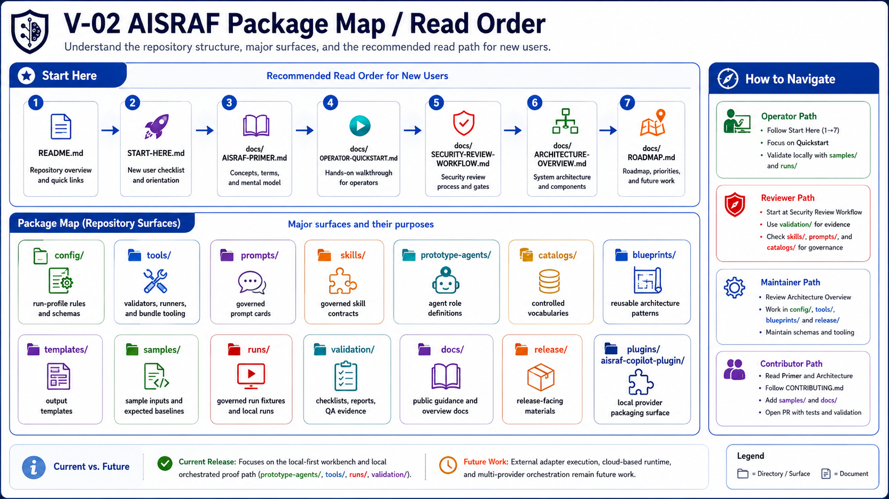
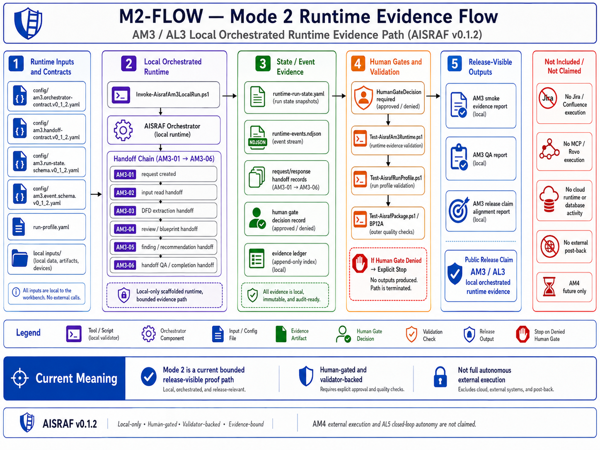
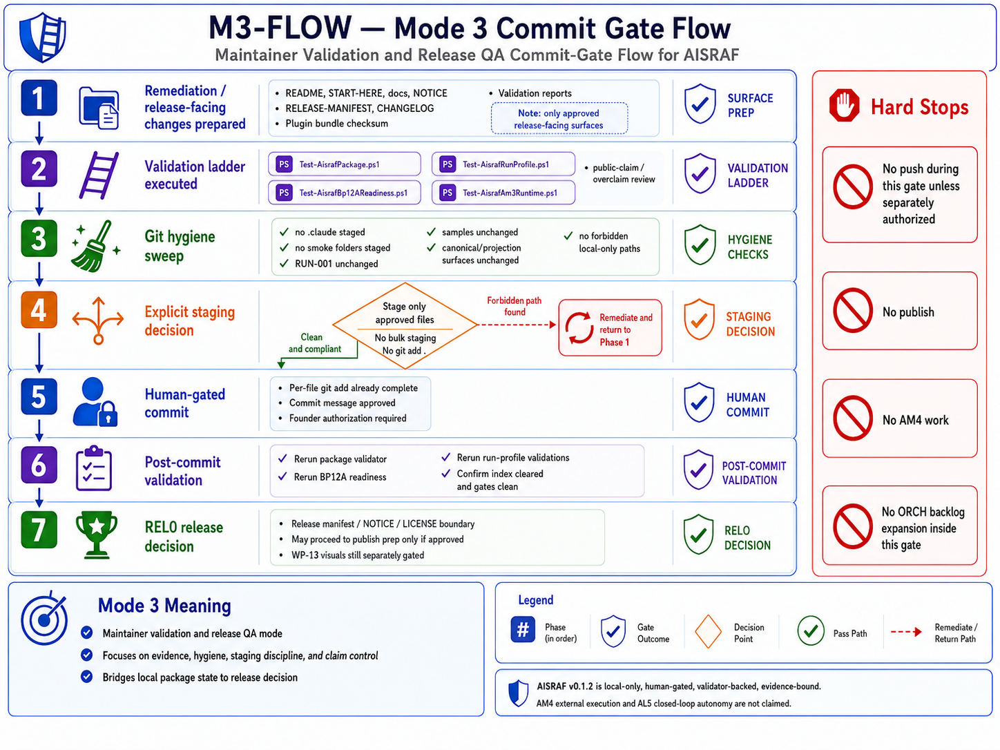
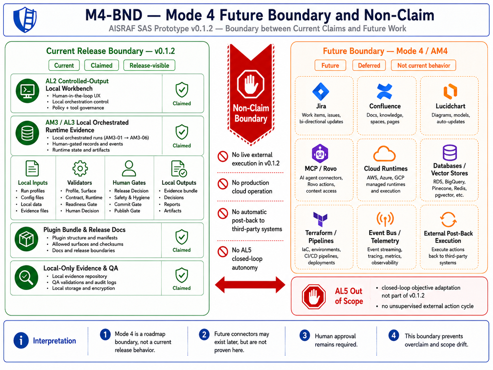

# AISRAF Architecture Overview

> **Public language note.** AISRAF as a product is described as a set of named flows (Local Orchestrated Review, Run Observability / Runtime Evidence, Release QA Flow, planned Connected Review Flow, planned Threat Intelligence Enrichment, planned Plugin Install UX). See [PRODUCT-FLOW-ROADMAP.md](PRODUCT-FLOW-ROADMAP.md) for the full operating model. The `AM` / `AL` / `Mode N` vocabulary remains as internal architecture/evidence vocabulary in contracts, runtime files, and validation artifacts.

## Internal Autonomy Vocabulary (For Contributors Only)

- **AL means Autonomy Level:** how autonomous the user experience is (internal evidence vocabulary).
- **AM means Autonomy Mode / release evidence lane:** how AISRAF proves that autonomy capability (internal evidence vocabulary).
- **AM3 / AL3:** internal name for the local orchestrated runtime evidence path captured by Flow 2 (Run Observability / Runtime Evidence).
- **AM4 / AL4:** internal name for the future external-adapter/post-back capability covered by Flow 4 (planned Connected Review Flow).
- **AL5:** closed-loop autonomy; out of scope.

| Field | Value |
|---|---|
| Document | docs/ARCHITECTURE-OVERVIEW.md |
| Source draft | validation/package-12c-architecture-overview-draft.md |
| Promoted by | WP-12C-REL0-B — Public Release Docs |
| Release | AISRAF v0.1.2 |
| Current claim | AM3 / AL3 local orchestrated multi-agent runtime evidence is proven |
| External execution | not claimed; provider projections and plugin packaging are not runtime proof |

## 1. Architecture Summary

AISRAF is a governed local AI-assisted security architecture review workbench. It keeps canonical review logic in package source folders, projects thin provider-facing surfaces for operator use, validates boundaries through local tools and hooks, and treats plugin packaging as a projection layer rather than a source of truth.

The current package is a public-safe local workbench with bounded AM3 / AL3 local orchestrated multi-agent runtime evidence. It is evidence-bound and validation-backed. It is **not** a production cloud service, **not** a live external-integration runtime, and **not** a claim of full specialist-generated review output execution.

Publication posture: public source-available evaluation-only proof-of-concept. Not open source. Not production software. Not marketplace-published. Local Orchestrated Review (Flow 1) is the everyday user path; Run Observability / Runtime Evidence (Flow 2) is captured alongside it. No Connected Review Flow (Flow 4 / internal AM4) execution in v0.1.2. No Jira, Confluence, Lucidchart, Rovo/MCP, cloud, database, Terraform, event bus, telemetry, or external post-back execution in v0.1.2. No Threat Intelligence Enrichment (Flow 5) in v0.1.2. Closed-loop autonomy is out of scope.

## Visual Architecture Map

These diagrams show package structure, AM3 runtime evidence, maintainer gate flow, and the future-only AM4 boundary. They are public evaluation documentation only and do not add marketplace, production, cloud, database, Terraform, event bus, telemetry, external post-back, AM4, or AL5 behavior.









## 2. Concept-To-Release Spine

```text
Concept
  → Stakeholder / Scenario
  → Value Outcome
  → Value Stream / Stage
  → Capability
  → ProcessFlowSpecification
  → TaskFlowSpecification
  → Agent Specification
  → Skill Contract
  → Tool / Hook / Policy
  → Knowledge / Data Product Contract
  → Memory / State
  → Evaluation / Metrics
  → Evidence
  → Platform Projection
  → Plugin
  → Solution Package / Release
```

The spine keeps AISRAF honest. A process or task spec is design-time, not runtime proof. A plugin is a projection surface, not a release. A release requires QA, public-safety evidence, staging, docs, manifest, license, notice, and release approval.

## 3. Canonical Source Surfaces

Canonical source lives in these package folders:

| Surface | Purpose |
|---|---|
| `prompts/` | Prompt cards (rs/ + dfd/), with prompt registry |
| `skills/` | Skill contracts (rs/ + dfd/), with skill registry |
| `prototype-agents/` | 8 PRA specs (PRA-01..PRA-08) plus registry and template |
| `catalogs/` | 24 controlled-vocabulary YAML catalogs across 7 families |
| `blueprints/` | 9 controlled blueprints across 2 categories |
| `templates/` | 31 controlled output templates across 4 families |
| `config/` | Run-profile schema, samples, validation rules, sensitive-data rules |
| `tools/` | Validators, hook scripts, plugin bundle builder |
| `validation/` | Checklists, audit reports, work-package planning artifacts |
| `samples/` | `sample-001-dfd-crop/` (canonical fixture; do not mutate) |
| `runs/RUN-001/` | Governed canonical run fixture (do not mutate) |

Canonical source remains in these folders. Provider projections and plugin bundles must reference or checksum-copy canonical material without becoming source of truth.

## 4. Provider Projection Surfaces

Provider projections make AISRAF usable in local/provider workflows without claiming runtime authority:

| Surface | Purpose |
|---|---|
| `.agents/` | 7 canonical aisraf-*.agent.md adapters |
| `.github/agents/` | Copilot discovery projection (byte-identical to `.agents/`) |
| `.github/skills/<name>/SKILL.md` | 7 provider Agent Skills packages |
| `.github/hooks/aisraf-guardrails.json` | Provider hook config (PreToolUse, PostToolUse, Stop) |
| `.copilot-skills/` | 7 thin skill wrappers + 7 operator cards |
| `plugins/aisraf-copilot-plugin/` | Plugin scaffold + bundle + checksum manifest + plugin.json |

Projection surfaces do not authorize runtime, cloud, database, Terraform, MCP, Jira, Confluence, Lucidchart, or external post-back claims.

## 5. Agents, Skills, Hooks, Validators, Templates, Catalogs, Blueprints, Run Profiles, Evidence Controls

- **Agents.** 7 AISRAF agents (`@aisraf-orchestrator` plus 6 specialist agents). The orchestrator is the recommended entry point; specialists remain available as direct entrypoints for expert use.
- **Skills.** 17 RS skill contracts and 9 DFD skill contracts on the canonical side; 7 thin operator-facing skill wrappers and 7 operator cards under `.copilot-skills/`; 7 provider Agent Skills packages under `.github/skills/`.
- **Hooks.** 4 conservative hook scripts under `tools/hooks/`: `aisraf-allowed-path-prewrite-guard.ps1` (path guard before write), `aisraf-focused-validator-postwrite.ps1` (focused validator after write), `aisraf-session-stop-summary.ps1` (session summary on stop), `aisraf-precommit-full-validator.ps1` (full validator before commit). The provider hook config wires PreToolUse/PostToolUse/Stop events to the first three.
- **Validators.** `tools/Test-AisrafPackage.ps1` (package surface, content limits, projections, plugin bundle). `tools/Test-AisrafBp12AReadiness.ps1` (BP12A readiness harness). `tools/Test-AisrafRunProfile.ps1` (run-profile schema, scoring coupling, sensitive-data screen).
- **Templates.** 31 controlled output templates (27 output + 1 jira + 1 confluence + 2 run) under `templates/`.
- **Catalogs.** 24 controlled-vocabulary YAML catalogs under `catalogs/` across 7 families: components, interactions, boundaries, identity-access, data-protection, security-stacks, review.
- **Blueprints.** 9 controlled blueprints under `blueprints/`: 8 platform-independent + 1 cloud-pattern.
- **Run profiles.** Schema, template, and samples under `config/`. Each review run is governed by a `run-profile.yaml` validated by `Test-AisrafRunProfile.ps1`.
- **Evidence controls.** Path guards, focused validators, sensitive-data screen, scoring eligibility coupling, no-fake-proof rules, unknown preservation, byte-identical projection enforcement, plugin bundle SHA-256 checksum manifest.

## 6. Local Orchestrated Review Vs Run Observability Evidence

Release-visible flow boundaries:

| Flow | Architectural boundary |
|---|---|
| Local Orchestrated Review (Flow 1) | Current everyday practitioner flow. Agent sessions produce governed local Markdown only under approved run folders, with path guards and validators. Includes an optional preview-first step (read-only inspection of role instructions, source surfaces, run profiles, planned outputs, and release evidence). |
| Run Observability (Flow 2) | Captured alongside Flow 1. AISRAF Orchestrator owns run-state and event log. Target evidence set per run: `00-run-log.md`, `runtime/run-state.yaml` (or equivalent), `runtime/events.ndjson` (or equivalent), handoff records (internal AM3-01 through AM3-06 representation), human gate records, validation result summary. v0.1.2 emits this evidence through the local runtime evidence harness (`tools/Invoke-AisrafAm3LocalRun.ps1` + `tools/Test-AisrafAm3Runtime.ps1`); the target product experience is for the orchestrator to auto-emit during Flow 1. |
| Release QA Flow (Flow 3) | Maintainer-only validation path for package shape, projection checks, bundle checksum validation, blocker registers, license/overclaim scans, and release QA reports. |
| Connected Review Flow (Flow 4) | Planned for v0.2.0. External systems, cloud runtime, database, Terraform, event bus, telemetry, and post-back execution are not current. |
| Threat Intelligence Enrichment (Flow 5) | Planned for v0.2.1. Not current. |
| Mermaid Diagram Generation (Flow 6) | Planned. Generates a corrected Mermaid DFD from extracted facts as a review aid; original input diagram stays separate. Not current. |
| Plugin Install UX (Flow 7) | Repo-local evaluation today; clean install/load UX planned for v0.1.3 onward. |

Closed-loop autonomy is out of scope.

Current security architect and application architect Local Orchestrated Review experience:

- One selected AISRAF agent session (typically `@aisraf-orchestrator`) acts as a temporary orchestrator that walks the operator through the chain sequentially.
- Specialist agents remain available as direct entrypoints for expert use.
- All writes are operator-driven, controlled-output, path-guarded, validator-followed.
- All outputs are local Markdown files. There is no runtime delegation, no agent-side runtime state, no agent-owned tools beyond the four conservative hook scripts, no runtime policy enforcement layer, no runtime evidence emission layer.

Accepted Run Observability / Runtime Evidence path (internal vocabulary: AM3 / AL3):

- AISRAF v0.1.2 proves local orchestrated multi-agent runtime evidence.
- The evidence is local-only, human-gated, validator-backed, and evidence-bound.
- AISRAF Orchestrator owns run-state and event log.
- Specialist handoffs are represented internally by AM3-01 through AM3-06 request/response pairs.
- Human gates remain required.
- The local smoke evidence is under `runs/RUN-SMOKE-AM3-001/runtime/` and must not be staged or published in this gate.

This is an evidence-path claim, not a claim of full specialist-generated review output execution, production readiness, publication, or Connected Review Flow (Flow 4 / internal AM4) integration. Connected Review Flow external adapter execution remains future (v0.2.0).

## 7. Plugin Vs Release

- **Plugin** = installable/projection surface that bundles the orchestrator, the seven specialist agents, the seven skill wrappers and operator cards, the seven provider Agent Skills packages, and the provider hook config. It mirrors canonical material by reference and SHA-256 checksum, not by re-authoring authority.
- **Release** = governed publication package with manifest, license, notice, changelog, docs, QA, staging, public-safety evidence, and an explicit release-gate authorization.

The plugin package proves provider projection and checksum alignment (validated by `Test-AisrafPackage.ps1` Check 16, 16a, 16b, and 16c). It does not, by itself, prove production operation, marketplace publication, or external integrations.

## 8. Design-Time Vs Runtime

- PFS / TFS = design-time specs.
- `runs/RUN-001/` and `runs/RUN-SMOKE-*/` = runtime evidence / state (RUN-001 is governed; smoke runs are local-only and excluded from staging).
- QA / editor / release agents = package-governance agents, not PRA review agents.

PRA-01 through PRA-08 define the AISRAF security-review chain. QA, editor, primer, release, and future governance agents inspect or document the package; they do not run the security-review chain or produce findings, recommendations, AI Action Level classifications, blueprint matches, or scores.

## 9. Knowledge / Data Product Layer

- Catalogs = controlled vocabulary, not severity computers.
- Blueprints = review patterns, not findings.
- Templates = output contracts, not proof.
- Schemas / run profiles = execution contracts.
- Validation / evidence = proof contracts.

Unknowns, missing facts, deferred states, and insufficient evidence must remain visible.

## 10. Planned Adapter, Skill, And Diagram Map

The following are not implemented in the current package and may be discussed only as planned / not implemented:

Connected Review Flow (Flow 4, v0.2.0; see [CONNECTED-REVIEW-FLOW-PLAN.md](CONNECTED-REVIEW-FLOW-PLAN.md)):

- Jira ticket intake.
- Confluence post-back.
- Lucidchart direct adapter.
- MCP runtime.
- Anthropic Claude runtime adapter.
- Azure AI Foundry runtime adapter.
- Google ADK adapter.
- Microsoft Agent Framework adapter.
- Database-backed runtime.
- Terraform / cloud deployment.
- Cloud runtime.
- Event bus.
- Telemetry backend.
- External post-back execution.
- Release automation.

Threat Intelligence Enrichment (Flow 5, v0.2.1; see [THREAT-INTELLIGENCE-ENRICHMENT-PLAN.md](THREAT-INTELLIGENCE-ENRICHMENT-PLAN.md)):

- `SKL-THREAT-INTEL-CURRENT-CONTEXT` — curated current sources (NVD CVE API, CISA KEV, vendor security advisories, official product documentation/security pages). No internet result becomes a finding automatically. Version/context confirmation required; source URL, retrieval date, and confidence required on every external fact; human approval required before promotion to a finding.

Mermaid Diagram Generation (Flow 6; see [PRODUCT-FLOW-ROADMAP.md](PRODUCT-FLOW-ROADMAP.md) section 8):

- Generate a corrected Mermaid DFD from extracted components, flows, trust boundaries, data classifications, authentication / authorization, encryption-in-transit, and storage / at-rest protection. The generated diagram is a review aid — never ground truth. The original input diagram and any generated diagram remain at separate paths. Mermaid syntax and DFD annotation rules are validated before exposure to the operator.

## 11. Validator Ladder

```powershell
pwsh -NoProfile -File ./tools/Test-AisrafPackage.ps1
pwsh -NoProfile -File ./tools/Test-AisrafBp12AReadiness.ps1
pwsh -NoProfile -File ./tools/Test-AisrafRunProfile.ps1 -RunProfilePath ./runs/RUN-001/run-profile.yaml -ExecutionReady
```

### 11.1 Cross-Shell Command Posture

The validator ladder above is written for **PowerShell 7 (`pwsh`)** because that is the shell tested by the gate. **Windows PowerShell (`powershell.exe`)** and **Git Bash invoking `powershell.exe`** are expected to work for these `.ps1` scripts, but cross-shell command parity is **not yet validated by an automated gate**. The next gate (`WP-12C-REL0-CROSS-SHELL-COMMAND-UX`) is responsible for that parity check. Until that gate passes, do not assume Windows PowerShell or Git Bash invocations match the `pwsh` baseline.
