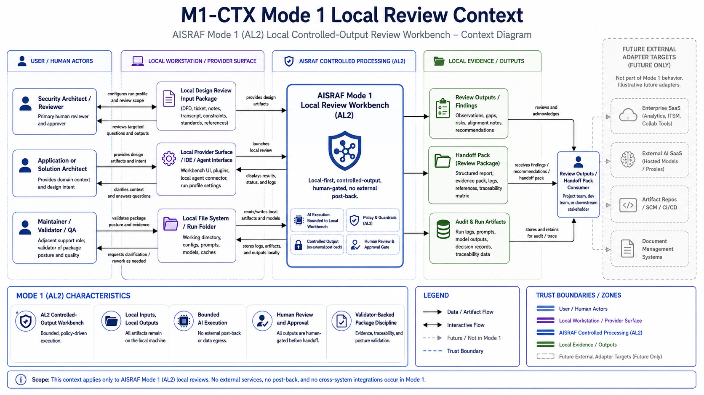
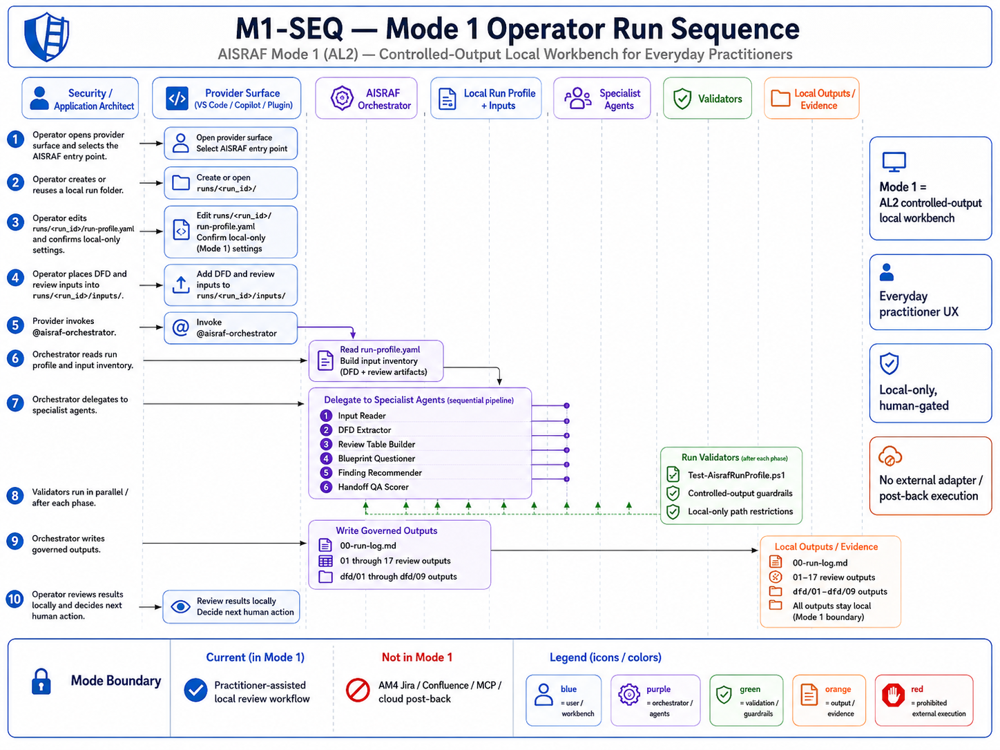
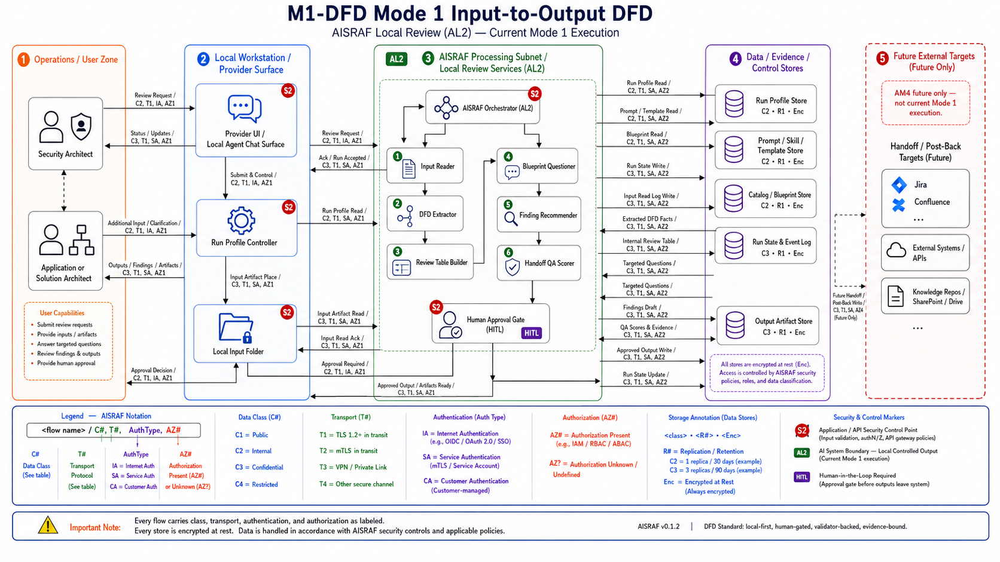

# AISRAF Operator Quickstart

## Autonomy Terms In Plain English

- **AL means Autonomy Level:** how autonomous the user experience is.
- **AM means Autonomy Mode / release evidence lane:** how AISRAF proves that autonomy capability.
- **Mode 0:** preview/read-only; no writes.
- **Mode 1 / AL2:** everyday controlled-output local workbench.
- **Mode 2 / AM3 / AL3:** local orchestrated runtime evidence path.
- **Mode 3:** maintainer validation and release QA.
- **Mode 4 / AM4:** future external adapter/post-back execution.
- **AL5:** closed-loop autonomy; out of scope.

| Field | Value |
|---|---|
| Document | docs/OPERATOR-QUICKSTART.md |
| Source draft | validation/package-12c-operator-quickstart-draft.md |
| Promoted by | WP-12C-REL0-B — Public Release Docs |
| Release | AISRAF v0.1.2 |
| Current claim | AM3 / AL3 local orchestrated multi-agent runtime evidence is proven |
| External execution | not claimed; no live Jira, Confluence, Lucidchart, MCP, cloud, database, Terraform, or post-back execution in v0.1.2 |

## 1. Start Here

AISRAF v0.1.2 is a local security architecture review workbench with bounded AM3 / AL3 local orchestrated runtime evidence. Start in preview mode. Confirm what each role reads, what it may write during an approved controlled-output gate, what stops it, and what it must not claim. Do not write files until the controlled-output gate is explicitly approved.

The day-to-day operator workflow remains the AL2 controlled-output workbench: one selected agent session acts as a temporary orchestrator that walks the operator through the chain sequentially. Separately, AM3 evidence proves the local orchestrated runtime path: AISRAF Orchestrator owns run-state and event log, specialist handoffs are represented by AM3-01 through AM3-06 request/response pairs, and human gates remain required. This is an evidence-path claim, not a claim of full specialist-generated review output execution, production readiness, publication, or AM4 integration.

Release journey modes:

| Mode | Operator meaning |
|---|---|
| Mode 0 - read/preview, no writes | Inspect the selected role, expected inputs, planned outputs, run profile, and stop conditions. No file changes. |
| Mode 1 - AL2 controlled-output workbench | Normal security architect / application architect path. The operator approves local Markdown writes under an approved run folder. |
| Mode 2 - AM3 / AL3 local orchestrated runtime evidence | Release-visible local runtime journey/proof path. AM3 shows the orchestrator-owned run-state, event log, AM3-01 through AM3-06 handoffs, and human gates in local evidence. |
| Mode 3 - maintainer validation and release QA | Maintainer path for package validation, bundle checksum validation, release manifests, blocker registers, and QA reports. |
| Mode 4 - AM4 external adapter / post-back execution | Future only. No Jira, Confluence, Lucidchart, MCP, cloud, database, Terraform, event bus, telemetry, or post-back execution occurs in v0.1.2. |

AL5 closed-loop autonomy remains out of scope.

## Mode 1 Visual Map

These diagrams show the everyday AL2 local controlled-output operator journey. They do not claim external adapter execution, marketplace publication, production operation, AM4 execution, or AL5 autonomy.







## 2. Install And Discovery Expectation

For the public GitHub proof-of-concept, clone or download the repository and open the repository folder in VS Code. The AISRAF v0.1.2 package is delivered from the repository folder under `plugins/aisraf-copilot-plugin/`. Discovery happens through your local/provider surface (VS Code Local plugin list, GitHub Copilot agent dropdown, or Copilot CLI) from the repository package surface, not through marketplace publication. v0.1.2 is not marketplace-published.

License posture: public source-available evaluation-only proof-of-concept. Not open source. Not production software. AM3 / AL3 local orchestrated runtime evidence only. AL2 controlled-output workbench remains the everyday user path. No AM4 adapter execution. No Jira, Confluence, Lucidchart, Rovo/MCP, cloud, database, Terraform, event bus, telemetry, or external post-back execution in v0.1.2. AL5 closed-loop autonomy is out of scope.

Once the local/provider surface loads the package, the operator should see:

- 7 AISRAF agents: `@aisraf-orchestrator`, `@aisraf-input-reader`, `@aisraf-dfd-extractor`, `@aisraf-review-table-builder`, `@aisraf-blueprint-questioner`, `@aisraf-finding-recommender`, `@aisraf-handoff-qa-scorer`.
- 7 provider Agent Skills packages under `.github/skills/<name>/SKILL.md` (loaded through the agents).
- 1 provider hook config (`.github/hooks/aisraf-guardrails.json`) declaring `PreToolUse`, `PostToolUse`, and `Stop` events.

## 3. Two Local Workspaces You May See

- **Public POC checkout** = the cloned/downloaded GitHub repository. Use this workspace for the first-run scaffold, local inputs, run-profile validation, and local Markdown outputs.
- **Maintainer smoke workspace** = a clean installed-plugin UX proof workspace used by maintainers. Empty state is expected there until a maintainer stages local inputs; it proves installed-plugin discovery without relying on workspace-local customization folders.

Opening a governed repo file inside a separate smoke VS Code window does not make that file part of the smoke workspace.

## 4. Run-Profile Variables

Each review run is controlled by a `run-profile.yaml` under the run folder. The reference shapes are:

- `runs/RUN-001/run-profile.yaml` — governed fixture, do not mutate.
- `config/run-profile.template.yaml` — template for new runs.
- `config/run-profile.sample.folder-first.yaml` — folder-first sample.
- `config/run-profile.sample.integration.yaml` — sample showing future integration fields (deferred adapters; not active in v0.1.2).

Key fields:

- `run_id` — the run folder name under `runs/<run_id>/`.
- `inputs` — local input file paths under `runs/<run_id>/inputs/`.
- `outputs` — output destination is always local Markdown under the run folder.
- `output_destination_mode` — `local_only` in v0.1.2; integration modes are deferred.
- `external_execution` — must be `false` in v0.1.2.
- `sensitive_data_confirmed_redacted` — operator must affirm sensitive-data redaction.

The evidence ledger is `runs/<run_id>/00-run-log.md`. Inputs live under `runs/<run_id>/inputs/`. Generated outputs are the root `01` through `17` Markdown files plus `dfd/01` through `dfd/09`.

Use a separate `runs/<run_id>/` folder for each separate DFD or review. Do not reuse `runs/RUN-001/`; it is the governed fixture.

Validate any run profile with:

```powershell
pwsh -NoProfile -File ./tools/Test-AisrafRunProfile.ps1 -RunProfilePath ./runs/<run_id>/run-profile.yaml -ExecutionReady
```

## 5. Local Folder-First Operation

v0.1.2 operates in folder-first-only mode. Every input is a local file. Every output is a local Markdown file under the approved run folder. AM3 runtime evidence is also local-only, human-gated, validator-backed, and evidence-bound. AISRAF does not contact Jira, Confluence, Lucidchart, Rovo/MCP, cloud, databases, Terraform, event buses, or telemetry backends. There is no post-back execution.

If a run profile attempts to enable an external integration field, the run-profile validator fails closed.

## 6. First-Run Journey (Preview Mode First)

1. Clone or download the public GitHub proof-of-concept repository.
2. Open the repository folder in VS Code.
3. Confirm the AISRAF local/provider surface appears. **Start with `@aisraf-orchestrator`.**
4. Create a personal run folder with the sample inputs:

```powershell
pwsh -NoProfile -File ./tools/New-AisrafRun.ps1 -RunId RUN-MY-REVIEW-001 -SampleId sample-001-dfd-crop -CopySampleInputs
```

5. Place or review DFD/design inputs under `runs/RUN-MY-REVIEW-001/inputs/`.
6. Edit `runs/RUN-MY-REVIEW-001/run-profile.yaml`; set `sensitive_data_confirmed_redacted: true` only after confirming inputs are redacted.
7. Validate the run profile:

```powershell
pwsh -NoProfile -File ./tools/Test-AisrafRunProfile.ps1 -RunProfilePath ./runs/RUN-MY-REVIEW-001/run-profile.yaml -ExecutionReady
```

8. Ask what the orchestrator reads and writes, then run preview mode first. No file should change during preview.
9. Use this orchestrator prompt for the local controlled-output run: `Run a local folder-first AISRAF review using runs/RUN-MY-REVIEW-001/run-profile.yaml. Do not use external adapters. Write outputs only under runs/RUN-MY-REVIEW-001/.`
10. Review local Markdown outputs under `runs/RUN-MY-REVIEW-001/`; keep the run folder as local evidence/work product.
11. Do not use `runs/RUN-001/` for personal reviews; it is the governed fixture.
12. For another DFD or review, create another `runs/<run_id>/` folder and repeat the same local input, run-profile, validation, and output pattern.

If any role writes during preview, claims external execution, mutates `RUN-001`, mutates `samples/`, or makes a live integration claim, stop and record the gap.

## 7. Security Architect Path

A security architect uses AISRAF as a local review assistant on a received design package:

1. Stage inputs locally (DFD image or Mermaid source, legend, design notes, intake ticket text, triage notes, transcript) under `runs/<run_id>/inputs/`.
2. Start with `@aisraf-orchestrator` from the local/provider surface.
3. Walk the chain sequentially through specialist roles to produce: input inventory (`01`), visible DFD facts (`02`), legend normalization (`03`), components and flows (`04`–`05`), boundaries and security-stack assessment (`06`–`07`), internal review table (`08`), missing facts (`09`), AI Action Level classification from the governed catalog (`10`), blueprint match (`11`), targeted questions (`12`), findings (`13`), recommendations (`14`), handoff pack (`15`), validation notes (`16`), and accuracy score where eligible (`17`).
4. Review unknowns and evidence. Findings must trace to evidence. Recommendations must trace to findings and to blueprint/question context.
5. Hand off the local Markdown outputs to your usual review channels. There is no automated post-back to Jira, Confluence, or any external system in v0.1.2.

## 8. Application / Solution Architect Path

An application or solution architect can use AISRAF locally as a shift-left lint pass over their own design package before formal security review:

1. Self-check the DFD locally. Confirm that data classifications, source/destination, trust-boundary crossings, authentication and authorization signals, encryption in transit and at rest, and confidence level are visible — or flagged as Unknown.
2. Use the missing-facts output (`09-missing-facts.md`) to name the design questions security review will ask. Answer them before the meeting, not during it.
3. Use the review-table draft (`08-internal-review-table.md`) and targeted questions (`12-targeted-questions.md`) to update the design package before submitting to security review.
4. No external integrations are needed. Everything stays local.

## 9. What Not To Do

- Do not run `git add .`.
- Do not stage `.claude/`.
- Do not stage `runs/RUN-SMOKE-*/` folders.
- Do not edit `runs/RUN-001/`.
- Do not edit `samples/`.
- Do not edit `catalogs/`, `blueprints/`, `templates/`, `prompts/`, `skills/`, `prototype-agents/`, or `config/` without an approved work package.
- Do not claim AM3 / AL3 beyond the accepted local evidence path.
- Do not claim AM4 / AL4 or AL5 behavior as current.
- Do not claim live Jira, Confluence, Lucidchart, MCP, Foundry, ADK, MAF, database, Terraform, cloud runtime, event bus, telemetry backend, or external post-back execution.

## 10. Validator Ladder

```powershell
pwsh -NoProfile -File ./tools/Test-AisrafPackage.ps1
pwsh -NoProfile -File ./tools/Test-AisrafBp12AReadiness.ps1
pwsh -NoProfile -File ./tools/Test-AisrafRunProfile.ps1 -RunProfilePath ./runs/RUN-001/run-profile.yaml -ExecutionReady
```

All three must return 0 FAIL before any contribution or staging activity.
