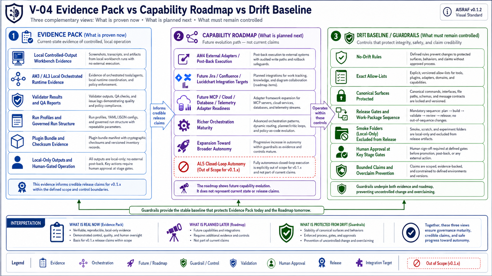

# AISRAF Roadmap

> **Public language note.** The legacy `Mode 0/1/2/3/4` numbered list is retired for public use. AISRAF as a product is now described as a set of named flows (Local Orchestrated Review, Run Observability / Runtime Evidence, Release QA Flow, planned Connected Review Flow, planned Threat Intelligence Enrichment, planned Plugin Install UX) — see [PRODUCT-FLOW-ROADMAP.md](PRODUCT-FLOW-ROADMAP.md). The `AM` / `AL` / `Mode N` vocabulary remains as **internal architecture/evidence vocabulary** in contracts, runtime files, and validation artifacts.

## Internal Autonomy Vocabulary (For Contributors Only)

- **AL means Autonomy Level:** how autonomous the user experience is (internal evidence vocabulary).
- **AM means Autonomy Mode / release evidence lane:** how AISRAF proves that autonomy capability (internal evidence vocabulary).
- **AM3 / AL3:** internal name for the local orchestrated runtime evidence path captured by Flow 2 (Run Observability / Runtime Evidence).
- **AM4 / AL4:** internal name for the future external-adapter/post-back capability covered by Flow 4 (planned Connected Review Flow).
- **AL5:** closed-loop autonomy; out of scope.

| Field | Value |
|---|---|
| Document | docs/ROADMAP.md |
| Source draft | validation/package-12c-roadmap-draft.md |
| Promoted by | WP-12C-REL0-B — Public Release Docs |
| Re-positioned by | WP-12C-AM3-PLAN — AM3 (AL3 local orchestrated multi-agent runtime) is now an in-release lane before final v0.1.2 publish |
| Runtime evidence | WP-12C-AM3-QA accepted the bounded AM3 / AL3 local runtime evidence path under `runs/RUN-SMOKE-AM3-001/runtime/` |
| Release | AISRAF v0.1.2 |
| Current claim | AISRAF v0.1.2 proves AM3 / AL3 local orchestrated multi-agent runtime evidence |
| Claim limiter | Evidence-path claim only; not full specialist-generated review output execution, production software, publication, or AM4 integration |
| Gate state | Release-decision stage commit closeout is accepted at HEAD `cc96644fa5263ccdaabcb0ff7ed9fb6282ac5ab5`; founder selected public source-available evaluation-only proof-of-concept posture |
| Current gate | WP-12C-REL0-FINAL-PUBLIC-QA |
| Next gate | REL0-STAGE-COMMIT, only if final public QA passes |
| Deferred autonomy | AM4 external adapter / post-back execution remains future adapter work; AL5 closed-loop autonomy remains out of scope |

## 1. v0.1.2 Current Claim: AM3 / AL3 Local Runtime Evidence

AISRAF v0.1.2 ships:

- The canonical source package: prompts, skills, prototype agents, catalogs, blueprints, templates, config, tools, validation, samples, and the governed `runs/RUN-001/` fixture.
- Provider projection surfaces: `.agents/`, `.github/agents/`, `.github/skills/`, `.github/hooks/`, `.copilot-skills/`.
- The plugin scaffold `plugins/aisraf-copilot-plugin/` with `bundle/`, `bundle-checksum-manifest.yaml`, `plugin.json`, and `plugin.yaml`.
- The four conservative hook scripts and the provider hook config wiring them to PreToolUse, PostToolUse, and Stop events.
- The validator ladder: `Test-AisrafPackage.ps1`, `Test-AisrafBp12AReadiness.ps1`, `Test-AisrafRunProfile.ps1`.
- The public docs package: this document plus AISRAF-PRIMER, OPERATOR-QUICKSTART, SECURITY-REVIEW-WORKFLOW, ARCHITECTURE-OVERVIEW; and root release artifacts `RELEASE-MANIFEST.yaml`, `CHANGELOG.md`, `SECURITY.md`, `CONTRIBUTING.md`, `LICENSE`, `NOTICE.md`.

What the current release proves: AISRAF v0.1.2 proves AM3 / AL3 local orchestrated multi-agent runtime evidence, while preserving the AL2 controlled-output local workbench as the everyday operator experience. AM3 evidence is local-only, human-gated, validator-backed, and evidence-bound. AISRAF Orchestrator owns run-state and event log. Specialist handoffs are represented by AM3-01 through AM3-06 request/response pairs. Human gates remain required. The validator ladder returns 0 FAIL; package-validator WARN rows are limited to local-only smoke folders.

License and notice posture: `LICENSE` and `NOTICE.md` define a public source-available evaluation-only proof-of-concept. AISRAF v0.1.2 is not open source, not production software, and not marketplace-published. No AM4 adapter execution is included. No Jira, Confluence, Lucidchart, Rovo/MCP, cloud, database, Terraform, event bus, telemetry, or external post-back execution occurs in v0.1.2. AL5 closed-loop autonomy is out of scope.

Release flow status for v0.1.2:

| Flow | Release state |
|---|---|
| Local Orchestrated Review (Flow 1) | Current everyday security architect and application architect flow. Outputs are governed local Markdown files under approved run folders. |
| Run Observability (Flow 2) | Current. Captured alongside Flow 1. Target evidence set per run: `00-run-log.md`, `runtime/run-state.yaml` (or equivalent), `runtime/events.ndjson` (or equivalent), handoff records, human gate records, validation result summary. v0.1.2 emits this evidence through the local runtime evidence harness (`tools/Invoke-AisrafAm3LocalRun.ps1` + `tools/Test-AisrafAm3Runtime.ps1`); the target product experience is for the orchestrator to auto-emit during Flow 1. (Internal vocabulary: AM3 / AL3.) |
| Release QA Flow (Flow 3) | Current maintainer-only path for validator ladders, manifests, bundle checksum validation, blocker registers, license/overclaim scans, and QA reports. |
| Connected Review Flow (Flow 4) | Planned for v0.2.0. Jira, Confluence, Lucidchart, Rovo/MCP, cloud, database, Terraform, event bus, telemetry, and post-back execution remain deferred. (Internal vocabulary: AM4 / AL4.) |
| Threat Intelligence Enrichment (Flow 5) | Planned for v0.2.1. `SKL-THREAT-INTEL-CURRENT-CONTEXT` skill not implemented in v0.1.2. |
| Mermaid Diagram Generation (Flow 6) | Planned. Generates a corrected Mermaid DFD from extracted facts as a review aid; original input diagram stays separate. Not implemented in v0.1.2. |
| Plugin Install UX (Flow 7) | Repo-local evaluation today; clean install/load UX planned for v0.1.3 onward. |

Closed-loop autonomy is out of scope.

What the current release does **not** claim: full specialist-generated review output execution, Connected Review Flow (Flow 4 / internal AM4) external adapter execution, Threat Intelligence Enrichment (Flow 5), closed-loop autonomy (out of scope), marketplace publication, production operation, or any live external integration.

## Successor Release Lanes (Plain English)

| Release | Scope | Detailed plan |
|---|---|---|
| v0.1.3 | UX cleanup (terminology + operating-flow rebase landed across the WP-12C-REL0-PRODUCT-FLOW-* and WP-12C-REL0-OPERATING-FLOW-* gates), cross-shell command alignment, plugin install/load UX progress. | [PRODUCT-FLOW-ROADMAP.md](PRODUCT-FLOW-ROADMAP.md), [PLUGIN-INSTALL-UX-PLAN.md](PLUGIN-INSTALL-UX-PLAN.md), [BRANCH-RELEASE-STRATEGY.md](BRANCH-RELEASE-STRATEGY.md) |
| v0.2.0 | Connected Review Flow (Flow 4): Jira intake, Jira design-review issue create/update, Confluence handoff page draft/publish, Lucid/Lucidchart source ingestion, Rovo/MCP mediation, manual/local fallback, operator-approved post-back. | [CONNECTED-REVIEW-FLOW-PLAN.md](CONNECTED-REVIEW-FLOW-PLAN.md) |
| v0.2.1 | Threat Intelligence Enrichment (Flow 5): `SKL-THREAT-INTEL-CURRENT-CONTEXT` over NVD CVE API, CISA KEV, vendor advisories, official product documentation/security pages. | [THREAT-INTELLIGENCE-ENRICHMENT-PLAN.md](THREAT-INTELLIGENCE-ENRICHMENT-PLAN.md) |
| v0.2.2 (tentative) | Mermaid Diagram Generation (Flow 6): corrected Mermaid DFD generated from extracted facts as a review aid; original input diagram stays separate. | [PRODUCT-FLOW-ROADMAP.md](PRODUCT-FLOW-ROADMAP.md) section 8 |
| v0.3.0 | Runtime state store / observability backend / stronger product packaging (auto-emit of run-state and event log into Flow 1). | [BRANCH-RELEASE-STRATEGY.md](BRANCH-RELEASE-STRATEGY.md) |
| Out of scope | Closed-loop autonomy (no `Mode 5`, no `AL5` work package). | — |

Nothing in the v0.2.x or v0.3.x lanes is implemented in v0.1.2. The current release-hardening branch must not implement Jira, Confluence, Lucid, Rovo/MCP, online threat intelligence, cloud runtime, database runtime, Terraform, event bus, telemetry backend, or marketplace publication unless a separate feature gate is opened.

## Roadmap Visuals

These diagrams separate current evidence, future capability, and release guardrails. They are not runtime, marketplace, production, AM4, or AL5 proof.




> **AM3 lane accepted local runtime evidence.** AM3 makes no network call, executes no Jira / Confluence / Lucidchart / MCP / cloud / database / Terraform / event bus / telemetry action, and does not introduce closed-loop autonomy. AM3 lane scope, DoD, tests, risks, runtime, and QA are governed by `validation/package-12c-am3-runtime-plan.md`, `validation/package-12c-am3-definition-of-done.md`, `validation/package-12c-am3-test-plan.md`, `validation/package-12c-am3-risk-register.md`, `validation/package-12c-am3-smoke-retry-evidence-report.md`, and `validation/package-12c-am3-qa-report.md`. AM4 external adapter execution remains future.

## 2. WP-12C-AM3 Lane (Accepted Local Evidence Path)

The WP-12C-AM3 lane delivered the local evidence path for AM3 / AL3 as the closing release lane for v0.1.2 before final publication can be considered. The lane is gated:

- **WP-12C-AM3-PLAN** — scope, architecture, DoD, test plan, risk register (predecessor gate; planning only; no runtime code).
- **WP-12C-AM3-CONTRACTS** — authors the four AM3 contract / schema files under `config/` (`am3.orchestrator-contract.v0_1_2.yaml`, `am3.handoff-contract.v0_1_2.yaml`, `am3.run-state.schema.v0_1_2.yaml`, `am3.event.schema.v0_1_2.yaml`) and the human-gate contract embedded in the orchestrator contract (closed predecessor gate; contract layer only).
- **WP-12C-AM3-RUNTIME** — authors `tools/Invoke-AisrafAm3LocalRun.ps1` (local-only AM3 runner) and `tools/Test-AisrafAm3Runtime.ps1` (AM3 validator route), with runtime scaffold writes restricted to a selected non-RUN-001 `output_root/runtime/`. Local-only. No network call.
- **WP-12C-AM3-EVIDENCE / SMOKE RETRY** — executes the founder-approved AM3 smoke run and captures evidence under local-only `runs/RUN-SMOKE-AM3-001/runtime/`.
- **WP-12C-AM3-QA** — accepts only the bounded AM3 / AL3 local orchestrated multi-agent runtime evidence claim and rejects any full-output, production, publication, or AM4 claim.
- **WP-12C-AM3-RELEASE-CLAIM-ALIGNMENT** — closed language alignment gate for public docs and manifests. No runtime edits or AM4 work.
- **WP-12C-AM3-STAGE-COMMIT** — closed at `34c1d55ce79e6bb0f9f274bef335af42600ef3f7` as `WP-12C-AM3_STAGE_COMMIT_PASS_READY_FOR_REL0_FINAL_QA`.
- **WP-12C-REL0-FINAL-QA** — ran and returned `WP-12C-REL0_FINAL_QA_BLOCKED_WITH_REASON`.
- **REL0 final QA remediation** — closed at `abcad6feb16a94ed71c81f6620032584f22e5a68` as the accepted technical remediation baseline.
- **WP-12C-REL0-RELEASE-DECISION-REMEDIATION** — closed predecessor gate. Aligned release-decision metadata, plugin reader journey, plain-language autonomy terms, and exact validator allow-listing.
- **WP-12C-REL0-RELEASE-DECISION-RERUN / PUBLIC LICENSE NOTICE FIX EVAL** — accepted prior state for WP-13 entry. Public source-available evaluation-only posture is the release boundary.
- **WP-13-FIRST-PUBLIC-VISUAL-PACK-AND-PUBLICATION-EXPORT / PREP** — accepted predecessor gate. Registers the first public-quality visual pack, links visuals into public docs, records Markdown/Word/PDF publication export posture without committing DOCX/PDF binaries, and passes WP13 final QA / publication export prep.
- **WP-12C-REL0-FINAL-PUBLIC-QA** — current gate. Verifies public-reader readiness, legal boundary, visual clarity, plugin UX, publication export posture, validator ladder, and git hygiene before stage/commit.

Each AM3 gate requires the previous gate's evidence and passes the validator ladder with 0 FAIL.

## 3. WP-13: Release Visuals

WP-13 covers release diagrams and release visuals for the public evaluation package. The first public-quality visual pack is governed under [../diagrams/release-v0.1.2/](../diagrams/release-v0.1.2/) and registered in [../diagrams/diagram-registry.yaml](../diagrams/diagram-registry.yaml).

WP-13 does not create DOCX/PDF/PPTX/ZIP files, push, tag, create a GitHub Release, start AM4, edit runtime code, edit AM3 contracts, edit AM3 smoke evidence, edit `runs/RUN-001/`, edit samples, or mutate canonical/provider surfaces. Word and PDF publication outputs remain deferred to GitHub Release assets or later exact-path release authorization.

## 4. Historical Orchestration Planning Names

Earlier orchestration planning names are superseded for the v0.1.2 cycle by the WP-12C-AM3 lane. The active release claim is no longer "AL3 later"; the accepted claim is the bounded AM3 / AL3 local orchestrated multi-agent runtime evidence path described above.

Those historical names do not authorize new runtime behavior, staging, publication, or AM4 adapter work. The only current AM3 claim is the local-only, human-gated, validator-backed, evidence-bound path accepted by WP-12C-AM3-QA.

## 5. Connected Review Flow (Flow 4 / internal AL4) — Planned

Connected Review Flow covers external adapter / post-back execution. The following are planned adapter targets governed by [CONNECTED-REVIEW-FLOW-PLAN.md](CONNECTED-REVIEW-FLOW-PLAN.md) and are **not implemented in v0.1.2**:

- **Jira ticket intake** — read intake tickets from Jira instead of local Markdown.
- **Confluence post-back** — publish handoff packs to Confluence.
- **Lucidchart adapter** — read DFD source directly from Lucidchart.
- **MCP runtime** — integrate AISRAF agents into an MCP server / client topology.
- **Anthropic Claude runtime adapter** — first-party Claude runtime path (separate from current local-projection use).
- **Azure AI Foundry** — runtime adapter for Foundry-hosted agents.
- **Google ADK** — runtime adapter for the Google Agent Development Kit.
- **Microsoft Agent Framework (MAF)** — runtime adapter for MAF-hosted agents.
- **Database-backed runtime** — durable storage for run state, evidence, and audit trail.
- **Terraform / cloud deployment** — infrastructure-as-code for any cloud runtime path.
- **Cloud runtime** — managed-service execution path.
- **Event bus** — async coordination between specialist agents and external systems.
- **Telemetry backend** — runtime metrics, tracing, and observability.
- **External post-back execution** — generic post-back pipeline for external systems.

Each Connected Review Flow adapter is its own future work package and is targeted for v0.2.0. None are in v0.1.2 scope. Each will require its own QA, public-safety, and release-gate evidence before publication. The accepted Run Observability / Runtime Evidence path does not introduce Connected Review Flow capability.

## 6. Closed-Loop Autonomy (Internal AL5): Out Of Scope

Closed-loop autonomy (autonomous decision and action without operator-in-the-loop) is **not in current scope** for AISRAF. There is no AL5 work package on the roadmap. The Run Observability / Runtime Evidence flow preserves the existing human gates and does not relax them.

## 7. Release Gates In Order

```text
v0.1.2 (AM3 / AL3 local runtime evidence accepted; not published)
  → WP-12C-AM3-PLAN          (closed — scope, architecture, DoD, tests, risks)
  → WP-12C-AM3-CONTRACTS     (closed — AM3 contracts + schemas under config/)
  → WP-12C-AM3-RUNTIME       (closed — AM3 local runner + AM3 validator)
  → WP-12C-AM3-EVIDENCE      (closed — local smoke evidence captured)
  → WP-12C-AM3-QA            (closed — bounded evidence claim accepted)
  → WP-12C-AM3-RELEASE-CLAIM-ALIGNMENT (closed — public language alignment)
  → WP-12C-AM3-STAGE-COMMIT  (closed — commit 34c1d55ce79e6bb0f9f274bef335af42600ef3f7)
  → REL0-FINAL-QA            (ran — blockers found)
  → REL0 final QA remediation (closed — commit abcad6feb16a94ed71c81f6620032584f22e5a68)
  → WP-12C-REL0-RELEASE-DECISION-REMEDIATION (closed predecessor)
  → WP-12C-REL0-RELEASE-DECISION-RERUN / PUBLIC LICENSE NOTICE FIX EVAL (accepted prior state)
  → WP-13 release visuals and publication export prep (closed — ready for final public QA)
  → WP-12C-REL0-FINAL-PUBLIC-QA (current)
  → REL0-STAGE-COMMIT
  → AL4 adapter work packages (one per adapter; future)
  → (AL5 is not on the roadmap)
```

Each gate requires the previous gate's evidence to be closed. Skipping gates is not authorized.

## 8. Validator Ladder

```powershell
pwsh -NoProfile -File ./tools/Test-AisrafPackage.ps1
pwsh -NoProfile -File ./tools/Test-AisrafBp12AReadiness.ps1
pwsh -NoProfile -File ./tools/Test-AisrafRunProfile.ps1 -RunProfilePath ./runs/RUN-001/run-profile.yaml -ExecutionReady
```

The validator ladder is written for **PowerShell 7 (`pwsh`)**. **Windows PowerShell (`powershell.exe`)** and **Git Bash invoking `powershell.exe`** are expected to work for these scripts, but cross-shell command parity is **not yet validated by an automated gate**. The next gate (`WP-12C-REL0-CROSS-SHELL-COMMAND-UX`) is responsible for that parity.
