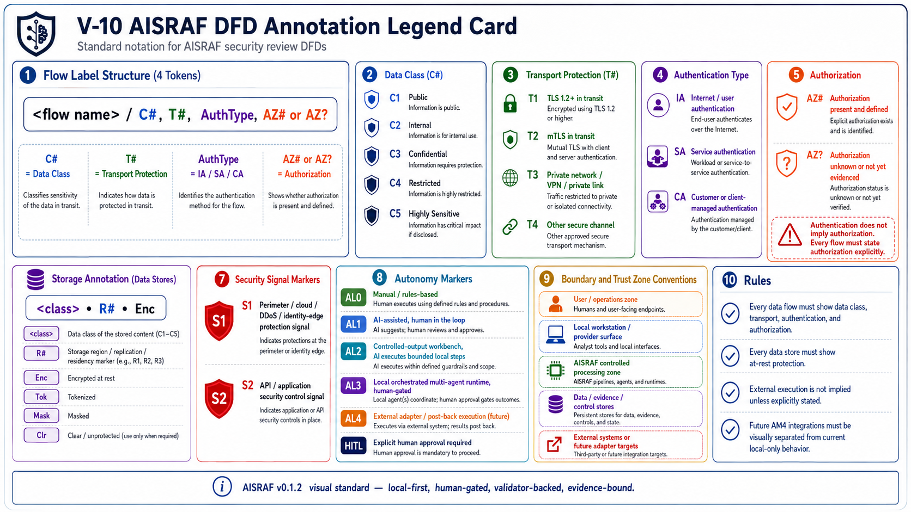
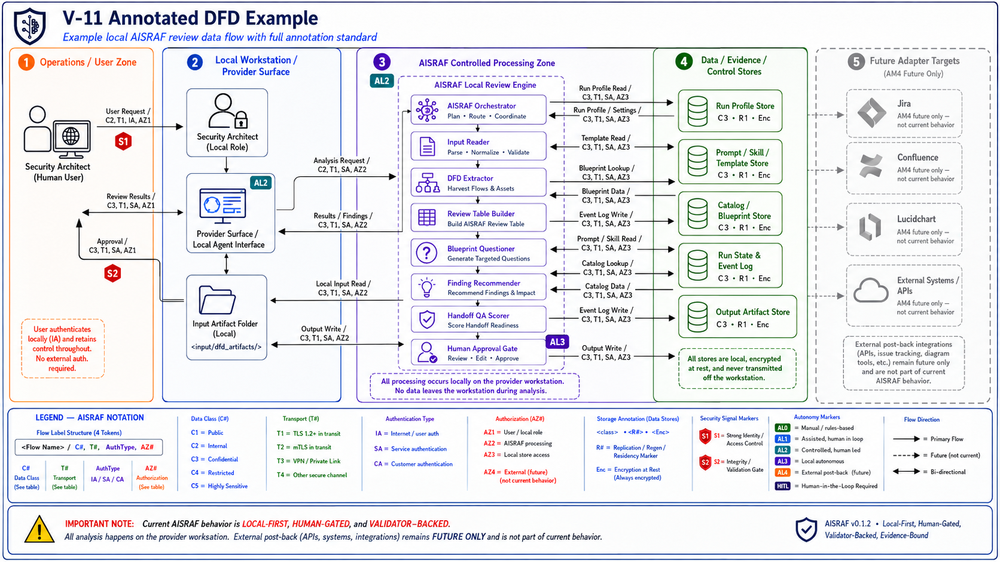

# AISRAF Security Review Workflow

> **Public language note.** AISRAF as a product is described as a set of named flows. The security review workflow lives in Flow 1 (Local Orchestrated Review). AISRAF captures observability evidence (Flow 2) alongside it. See [PRODUCT-FLOW-ROADMAP.md](PRODUCT-FLOW-ROADMAP.md) for the full operating model. The `AM` / `AL` / `Mode N` vocabulary remains as internal architecture/evidence vocabulary in contracts, runtime files, and validation artifacts.

## Internal Autonomy Vocabulary (For Contributors Only)

- **AL means Autonomy Level:** how autonomous the user experience is (internal evidence vocabulary).
- **AM means Autonomy Mode / release evidence lane:** how AISRAF proves that autonomy capability (internal evidence vocabulary).
- **AM3 / AL3:** internal name for the local orchestrated runtime evidence path captured by Flow 2 (Run Observability / Runtime Evidence).
- **AM4 / AL4:** internal name for the future external-adapter/post-back capability covered by Flow 4 (planned Connected Review Flow).
- **AL5:** closed-loop autonomy; out of scope.

| Field | Value |
|---|---|
| Document | docs/SECURITY-REVIEW-WORKFLOW.md |
| Source draft | validation/package-12c-security-review-workflow-draft.md |
| Promoted by | WP-12C-REL0-B — Public Release Docs |
| Release | AISRAF v0.1.2 |
| Current claim | AM3 / AL3 local orchestrated multi-agent runtime evidence is proven |
| External execution | not claimed; outputs are local Markdown only |

## 1. Two Entry Points

AISRAF v0.1.2 supports two entry points into the same governed review chain:

- **Pre-design-review (shift-left).** An application or solution architect runs AISRAF locally against their own draft DFD/design package before security architecture engages. Goal: arrive at security review with unknowns named, boundaries drawn, and controlled-vocabulary terms already used.
- **Post-design-review (security architect).** A security architect receives a DFD/design-review package and uses AISRAF to inspect it locally, preserve unknowns, generate targeted questions, structure the review table, draft findings and recommendations, and assemble handoff evidence.

Both entry points use the same chain, the same inputs shape, and the same output set. The differences are who runs it and what they do with the outputs.

Run Observability / Runtime Evidence (Flow 2) is local-only, human-gated, validator-backed, and evidence-bound. AISRAF Orchestrator owns run-state and event log, and specialist handoffs are represented internally by AM3-01 through AM3-06 request/response pairs. That evidence path does not prove full specialist-generated review output execution, production readiness, publication, or Connected Review Flow (Flow 4 / internal AM4) integration.

Release flow status in this workflow:

| Flow | Workflow meaning |
|---|---|
| Local Orchestrated Review (Flow 1) | Normal practitioner journey for security architects and application architects. The chain writes local Markdown only under an approved run folder. Includes an optional preview-first step (inspect the input package, selected role, expected output contract, and evidence requirements before any file is changed). |
| Run Observability (Flow 2) | Captured alongside Flow 1. Target evidence set per run: `00-run-log.md`, `runtime/run-state.yaml` (or equivalent), `runtime/events.ndjson` (or equivalent), handoff records, human gate records, and validation result summary. v0.1.2 emits this evidence today through the local runtime evidence harness (`tools/Invoke-AisrafAm3LocalRun.ps1` + `tools/Test-AisrafAm3Runtime.ps1`). The target product experience is for the orchestrator to auto-emit this evidence during Flow 1. |
| Release QA Flow (Flow 3) | Maintainer journey for proving package shape, validator results, release metadata, and blocker closure. Not run by security architects. |
| Connected Review Flow (Flow 4) | Planned for v0.2.0. Jira, Confluence, Lucidchart, Rovo/MCP, cloud, database, Terraform, event bus, telemetry, and post-back execution are not implemented in v0.1.2. |
| Threat Intelligence Enrichment (Flow 5) | Planned for v0.2.1. Not implemented in v0.1.2. |
| Mermaid Diagram Generation (Flow 6) | Planned. Generates a corrected Mermaid DFD from extracted facts as a review aid; original input diagram stays separate. Not implemented in v0.1.2. |
| Plugin Install UX (Flow 7) | Repo-local evaluation today; clean install/load UX planned for v0.1.3 onward. |

Closed-loop autonomy is not part of the workflow.

## 1a. Plain-English Journey Recap

Public users do **not** "run AM3." Public users run an **AISRAF Local Orchestrated Review**, and AISRAF captures observability evidence alongside the run.

**Application architect / solution architect — pre-review:**

1. Create a run folder.
2. Add DFD/source, legend, design notes, intake notes, and transcript or questionnaire under `runs/<run_id>/inputs/`.
3. Start with `@aisraf-orchestrator`.
4. Get missing facts, internal review table, targeted questions, suggested controls, and corrected-diagram guidance.
5. Improve the design package before formal security review.

**Security architect — review:**

1. Receive the staged design package.
2. Use `@aisraf-orchestrator` to run the review chain.
3. Review extracted components, flows, trust boundaries, data classifications, authentication / authorization, encryption-in-transit notes, and storage / at-rest protection.
4. Produce findings, recommendations, handoff pack, validation notes, and an accuracy score where eligible.
5. Keep unknowns visible.

## DFD Visual Standard

The public DFD visuals define the annotation standard used by AISRAF review outputs. Data class, authentication, authorization, encryption in transit, and store-at-rest protection must remain explicit where applicable.






## 2. Inputs Expected

The chain reads local files only:

- DFD or diagram image / source (`*.png`, `*.mmd`, etc.).
- Legend (`*-legend-excerpt.md`).
- Design notes / triage notes (`*.md`).
- Review transcript or questionnaire (`*.md`).
- Intake ticket text (`*.md`).
- Run profile (`runs/<run_id>/run-profile.yaml`).
- Sample fixture (`samples/sample-001-dfd-crop/`) for baseline proof.

Reference shape: `samples/sample-001-dfd-crop/inputs/` holds 6 files used by the canonical fixture and by the L2B controlled-output smoke run.

Jira ticket intake, Lucidchart direct read, Confluence publication, MCP runtime, cloud runtime, database-backed runtime, Terraform deployment, and external post-back are planned Connected Review Flow (Flow 4) adapter paths governed by [CONNECTED-REVIEW-FLOW-PLAN.md](CONNECTED-REVIEW-FLOW-PLAN.md). They are **not active in v0.1.2** and target v0.2.0.

## 3. Workflow Stages

The review chain runs sequentially under `@aisraf-orchestrator`, with specialist agents available as direct entrypoints for expert use:

1. Intake design package.
2. Inventory inputs.
3. Extract visible DFD objects.
4. Normalize legend.
5. Extract components.
6. Extract flows.
7. Identify boundaries.
8. Assess security stack.
9. Build internal review table.
10. Identify missing facts.
11. Classify AI Action Level only from the governed catalog.
12. Match blueprint from the governed blueprint registry.
13. Generate targeted questions.
14. Classify findings.
15. Write recommendations.
16. Build handoff pack.
17. Write validation notes.
18. Calculate accuracy score where eligible.

## 4. Outputs

Approved output set under `runs/<run_id>/`:

| File | Stage |
|---|---|
| `00-run-log.md` | Run-log evidence ledger |
| `01-input-inventory.md` | Inventory of staged local inputs |
| `02-visible-dfd-objects.md` | Visible DFD facts |
| `03-legend-normalization.md` | Legend normalization |
| `04-components.md` | Components |
| `05-flows.md` | Flows |
| `06-boundaries.md` | Boundaries |
| `07-security-stack-assessment.md` | Security-stack assessment |
| `08-internal-review-table.md` | Internal review table |
| `09-missing-facts.md` | Missing facts and unknowns |
| `10-ai-action-level.md` | AI Action Level (governed catalog) |
| `11-blueprint-match.md` | Blueprint match (governed registry) |
| `12-targeted-questions.md` | Targeted questions |
| `13-findings.md` | Findings |
| `14-recommendations.md` | Recommendations |
| `15-handoff-pack.md` | Handoff pack (local Markdown) |
| `16-validation-notes.md` | Validation notes |
| `17-accuracy-score.md` | Accuracy score (only when scoring is eligible) |

The 9 DFD subchain outputs live under `runs/<run_id>/dfd/`:

| File | Stage |
|---|---|
| `dfd/01-intake-quality-check.md` | Intake quality check |
| `dfd/02-boundary-catalog.md` | Boundary catalog |
| `dfd/03-component-catalog.md` | Component catalog |
| `dfd/04-flow-inventory.md` | Flow inventory |
| `dfd/05-annotation-resolution.md` | Annotation resolution |
| `dfd/06-boundary-crossings.md` | Boundary crossings |
| `dfd/07-control-signals.md` | Control signals |
| `dfd/08-confidence-score.md` | Confidence score |
| `dfd/09-extraction-summary.md` | Extraction summary |

Optional Jira/Confluence draft files (`jira-ticket-draft.md`, `confluence-page-draft.md`) may be produced as local Markdown drafts only. They are not posted to any external system in v0.1.2.

`runs/RUN-001/` is the governed canonical fixture. It must not be mutated by a review run. Stage your work in a different `runs/<run_id>/` folder.

## 5. Evidence Rules

The chain enforces these rules at every stage:

- Preserve `Unknown`, `Not Stated`, and `Deferred` explicitly. Never treat absence of evidence as evidence of absence.
- Do not invent controls, owners, implementation proof, or post-back actions.
- Do not infer implementation proof from diagram labels alone. A label says what the architect drew, not what the system enforces.
- Every finding must trace to evidence already extracted earlier in the chain.
- Every recommendation must trace to a finding and to blueprint/question context.
- Every output must stay inside the approved run folder during a controlled-output run.
- Catalog values must come from governed catalogs in `catalogs/` (24 controlled-vocabulary YAML catalogs across 7 families).
- Blueprint matching must use the governed blueprint registry in `blueprints/` (9 controlled blueprints across 2 categories).
- Scoring is eligible only when the run profile and baseline conditions support it.

## 6. Citation And No-Fake-Proof Posture

Every claim in the outputs must cite the input it came from (file name, section, line range, or visible-DFD object identifier). Where evidence is missing, the output records `Unknown` or `Not Stated` and adds the question to `09-missing-facts.md` and `12-targeted-questions.md` rather than guessing a value.

The chain does not synthesize "likely" controls, "probably" implemented protections, or "expected" identity flows. If a control is not visible in the input package, the chain says so.

## 7. Planned Future Features (Not Active In v0.1.2)

Connected Review Flow (Flow 4, v0.2.0), Threat Intelligence Enrichment (Flow 5, v0.2.1), and Mermaid Diagram Generation (Flow 6) are **planned** and are not active in v0.1.2.

### 7.1 Connected Review Flow (planned)

Adapter targets (see [CONNECTED-REVIEW-FLOW-PLAN.md](CONNECTED-REVIEW-FLOW-PLAN.md)):

- Jira ticket intake.
- Jira design-review issue create/update.
- Confluence handoff page draft/publish.
- Lucid/Lucidchart source ingestion.
- Rovo/MCP mediation.
- Anthropic Claude runtime adapter, Azure AI Foundry runtime adapter, Google ADK adapter, Microsoft Agent Framework adapter, database-backed runtime, Terraform / cloud deployment, cloud runtime, event bus, telemetry backend, external post-back execution.
- Local Markdown fallback always retained.
- Operator approval required before any post-back.

Planned **Jira design-review issue fields** (governed by [CONNECTED-REVIEW-FLOW-PLAN.md](CONNECTED-REVIEW-FLOW-PLAN.md)):

`review_id`, `title`, `business_context`, `system_context`, `app_owner`, `security_reviewer`, `data_classification`, AI / action level if applicable, source links/attachments, `boundary_crossings`, `authentication_authorization_notes`, `encryption_in_transit_notes`, `storage_at_rest_notes`, `known_unknowns`, `targeted_questions`, `finding_summary`, `recommendation_summary`, `status`, `evidence_links`.

Planned **Confluence handoff page sections**:

- Executive summary.
- Design context.
- Diagram / input inventory.
- Extracted architecture facts.
- DFD annotations.
- Missing facts.
- Threat intelligence summary (from Flow 5; not in v0.1.2).
- Targeted questions.
- Findings.
- Recommendations.
- Handoff actions.
- Validation summary.
- Evidence / citation ledger.

**Post-back rule.** No external post-back claim without **all** of: destination URL, operator approval, `postback_execution_status`, `00-run-log.md` entry, and adapter response metadata with no secrets. Until those conditions are met, every connected output is a local Markdown draft only.

### 7.2 Threat Intelligence Enrichment (planned)

`SKL-THREAT-INTEL-CURRENT-CONTEXT` — curated current sources (see [THREAT-INTELLIGENCE-ENRICHMENT-PLAN.md](THREAT-INTELLIGENCE-ENRICHMENT-PLAN.md)):

- NVD CVE API.
- CISA KEV.
- Vendor security advisories.
- Official product documentation / security pages.
- OSV / GitHub Security Advisories optional later.
- No internet result becomes a finding automatically.
- CVE matching requires version/context confirmation; unknown versions are recorded as `candidate risk / needs version confirmation`.
- Every external fact carries source URL, retrieval date, and confidence.
- Human approval is required before any threat-intel item becomes a finding or recommendation.

### 7.3 Mermaid Diagram Generation (planned)

Mermaid Diagram Generation (Flow 6) would generate a corrected Mermaid DFD from extracted components, flows, trust boundaries, data classifications, authentication / authorization, encryption-in-transit, and storage / at-rest protection. Rules (planned):

- Output goes to a separate local `.mmd` file under the run folder; an optional rendered PNG/SVG follows later where tooling exists.
- The generated diagram is **never** treated as ground truth. It is a review aid.
- The original input diagram and the generated diagram are kept as separate files at separate paths.
- Mermaid syntax and DFD annotation rules are validated before the generated diagram is exposed to the operator.
- Human approval is required before the generated diagram is treated as part of the review record.

These items may be discussed in design notes only as planned / not implemented. They are not live in the current package.

## 8. Validator Ladder

```powershell
pwsh -NoProfile -File ./tools/Test-AisrafPackage.ps1
pwsh -NoProfile -File ./tools/Test-AisrafBp12AReadiness.ps1
pwsh -NoProfile -File ./tools/Test-AisrafRunProfile.ps1 -RunProfilePath ./runs/RUN-001/run-profile.yaml -ExecutionReady
```

All three must return 0 FAIL before any review is reported as complete.
